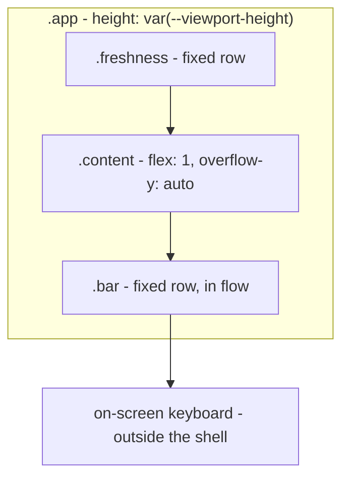
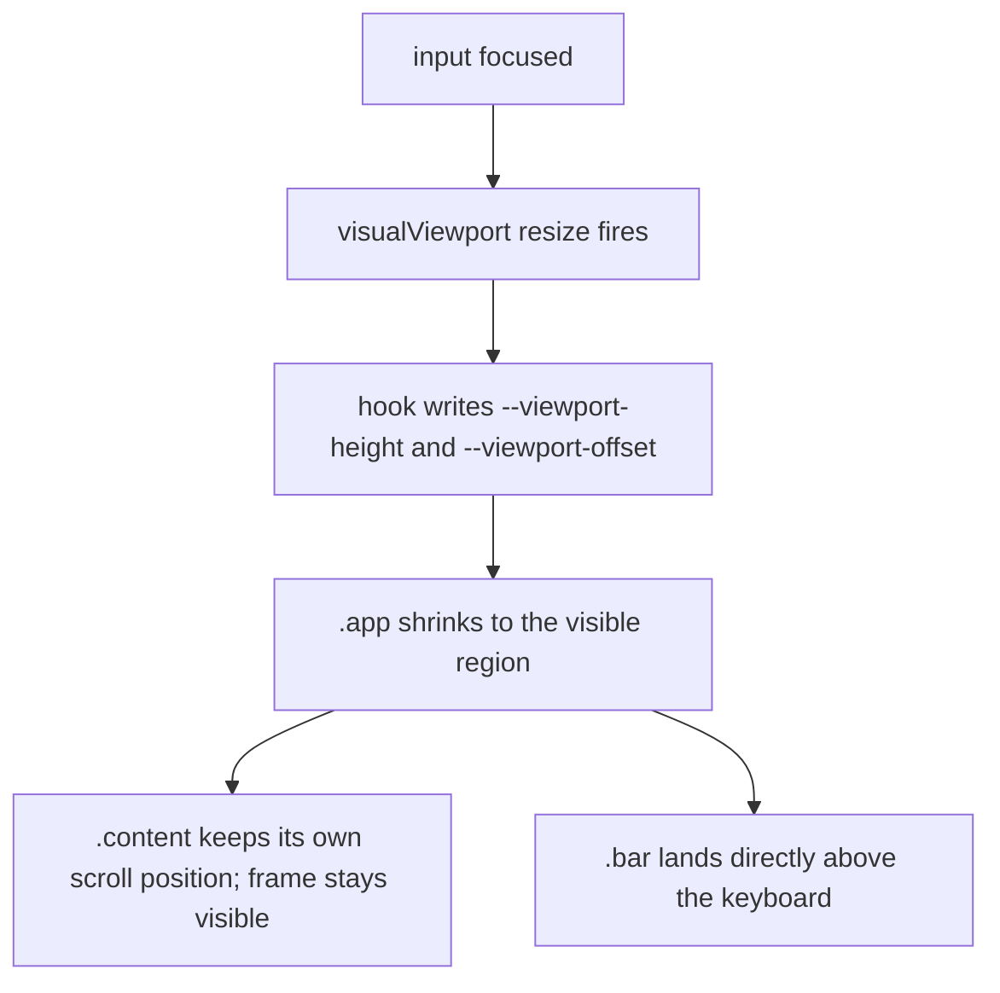

# Keep the Page Visible While Typing a Page Number - Plan

## Goal Capsule

- **Objective:** On a phone, the teletext frame stays readable while the reader types a page number into the bottom bar.
- **Means:** Make the shell a fixed-height, non-scrolling column sized from `window.visualViewport`, so the on-screen keyboard shrinks the app instead of pushing the document up (KTD1, KTD2).
- **Authority:** Requirements own product behaviour; KTDs own mechanism; units own file-level sequencing.
- **Execution profile:** One small front-end change in `src/index.css`, `index.html`, `src/App.tsx`, one new hook, and the app-level tests in `src/app.test.tsx`. No API, storage, or service-worker change.
- **Stop conditions:** Stop and report if keeping the shell fixed breaks sub-page scrolling on `331` (14 sub-pages), or if the visual-viewport listener cannot be exercised in `happy-dom` without stubbing more than `window.visualViewport`.
- **Tail ownership:** The caller owns commit, push, and PR.

---

## Product Contract

### Summary

Focusing the page-number input must not take the page away. The app becomes a fixed-height column that tracks the visual viewport: the freshness bar stays at the top, the frame occupies the space the keyboard leaves, and the bottom bar sits directly above the keyboard. Typing three digits still navigates and blurs, as today.

### Problem Frame

`.app` is `min-height: 100dvh` and `.bar` is `position: fixed; bottom: 0`. iOS does not shrink the layout viewport for the keyboard, so the bar is covered by it. Safari then scrolls the document to reveal the focused input, which pushes the frame off the top of the screen — the reported symptom: after focus, only the last two lines of page 300 remain visible above the status bar, and the rest of the screen is empty black.

### Requirements

**While the keyboard is open**

- R1. The frame the reader was looking at stays visible when the page-number input is focused.
- R2. The bottom bar stays fully visible directly above the keyboard, with its input, arrows and page number reachable.
- R3. The freshness bar stays at the top of the shell rather than scrolling out under the status bar.
- R4. The visible region ends at the top of the keyboard: no app content is rendered underneath it.

**After the keyboard closes**

- R5. Dismissing the keyboard — by the third digit's blur or by the accessory bar — returns the shell to full height with no leftover gap or offset.

**Unchanged behaviour**

- R6. Three digits still navigate and clear the input, and the arrows, home button and in-frame hotspots behave as they do today.
- R7. A page with several sub-pages stays scrollable through all of them, keyboard open or closed.
- R8. On a browser with no `window.visualViewport`, the shell is a full-viewport column, every navigation behaviour is unchanged, and nothing throws. The non-scrolling document and the in-flow bar apply on every browser.

### Acceptance Examples

- AE1. **Covers R1, R2, R3.** Given page 300 is open on a phone, when the reader taps the page-number input, then the frame's top lines and the freshness bar are still on screen and the bottom bar sits above the keyboard.
- AE2. **Covers R5.** Given the keyboard is open, when the reader types `1`, `0`, `0`, then page 100 loads, the keyboard closes, and the shell fills the screen again with no blank strip at the bottom.
- AE3. **Covers R7.** Given page 331 (14 sub-pages) is open with the keyboard up, when the reader drags on the frame, then the sub-pages scroll inside the visible region and the bottom bar does not move.
- AE4. **Covers R8.** Given a browser without `visualViewport`, when the app renders, then the shell is full height and nothing throws.

### Scope Boundaries

- The input stays in the bottom bar. No overlay, modal, or on-screen keypad of the app's own.
- No change to how a page is fetched, cached, or judged stale.
- The frame is not rescaled to fit the reduced height; it keeps its width-driven aspect ratio and the reader scrolls if needed.

---

## Planning Contract

### Key Technical Decisions

- KTD1. **The document never scrolls; `.content` is the only scroll container.** `html, body` get `overflow: hidden`, `.app` becomes `display: flex; flex-direction: column` at a fixed height, and `.content` takes `flex: 1; overflow-y: auto`. Rejected: leaving the document scrollable and only repositioning the bar — Safari's scroll-into-view still moves the document, which is the reported symptom.
- KTD2. **Height comes from `window.visualViewport`, applied as a CSS custom property.** A hook subscribes to the viewport's `resize` and `scroll` events and writes `--viewport-height` (and `--viewport-offset` for the visual viewport's `offsetTop`) onto the document element. Rejected: `interactive-widget=resizes-content` in the viewport meta — Chrome honours it, iOS Safari does not, and iOS is the reported platform.
- KTD3. **The bar stays in normal flow instead of `position: fixed`.** Inside a shell that already ends at the top of the keyboard, flow layout puts the bar in the right place with no transform to keep in sync. This removes the `.content` bottom-padding compensation that exists only because the bar overlaps the scroll area.
- KTD4. **The hook is a no-op without `visualViewport`.** It sets no custom property, so the CSS fallbacks in KTD5 apply and the shell stays a full-viewport column (R8). The KTD1 layout change itself is unconditional — the fallback restores the height, not the old document-scroll model.
- KTD5. **The shell is pinned to the visual viewport with `position: fixed` and a `translateY`.** `.app` takes `position: fixed; top: 0; left: 0; right: 0`, `height: 100vh` then `height: var(--viewport-height, 100dvh)`, and `transform: translateY(var(--viewport-offset, 0px))`. Rejected: compensating the offset with `padding-top` — that shrinks the content box inside a shell whose bottom edge has not moved, so the bar stays under the keyboard. The duplicated `100vh` declaration is the fallback for engines that have neither `dvh` nor `visualViewport`; without it `.app` would collapse to `height: auto` inside an unscrollable document.

### High-Level Technical Design

Shell composition with the keyboard open. The shell's height is the visual viewport, so every region inside it is on screen.

How a focus event resolves:

### Assumptions

- Safari reports the keyboard-reduced height on `visualViewport.height` while the keyboard is open. This is the documented behaviour and the basis of KTD2. If a device reports the full height with the keyboard open, stop and report — `offsetTop` is a shift, not a keyboard height, so deriving the height from it produces an arbitrary shell.
- `env(safe-area-inset-bottom)` remains the right bottom padding for the bar when the keyboard is closed, and is visually harmless when it is open.

### Sequencing

U1 lands the layout on its own and is verifiable without a keyboard. U2 adds the viewport tracking that makes the layout react. U3 covers both with an app-level test.

---

## Implementation Units

### U1. Fixed-height, non-scrolling shell

- **Goal:** Turn the app into a column that fills exactly the viewport, with `.content` as the only scroll container and the bar in flow.
- **Requirements:** R3, R7, and the mechanism in KTD1, KTD3 and KTD5. R4 needs U2's tracking before it holds.
- **Files:** `src/index.css`, `index.html` (the inline `html, body` block).
- **Approach:** Add `overflow: hidden` to `html, body`. Give `.app` the KTD5 rule — `position: fixed`, `top`/`left`/`right` at 0, `height: 100vh` then `height: var(--viewport-height, 100dvh)`, `transform: translateY(var(--viewport-offset, 0px))`, `display: flex`, `flex-direction: column`. `.content` needs `min-height: 0` alongside `flex: 1` or it grows the shell instead of scrolling. Give `.content` `flex: 1`, `min-height: 0` and `overflow-y: auto`, and drop its bar-height bottom padding — the bar no longer overlaps it. Remove `position: fixed`, `left`, `right`, `bottom` from `.bar`; keep its height, safe-area padding and border. Update the comments that explain the padding compensation, since the reason is gone.
- **Test scenarios:** Page 331 renders 14 frames and the reader can reach the last one (existing test covers rendering; scrolling is a manual check). Page 100 renders with the bar visible and no document scrollbar.
- **Verification:** `npm test`, `npm run build`, and a manual pass in `npm run dev` at a phone viewport size.

### U2. Track the visual viewport

- **Goal:** Publish the visible region's height and offset as CSS custom properties whenever the keyboard opens, closes, or moves the viewport.
- **Requirements:** R1, R2, R4, R5, R8, per KTD2 and KTD4.
- **Files:** `src/useVisualViewport.ts` (new), `src/App.tsx`, `src/app.test.tsx`.
- **Approach:** The hook reads `window.visualViewport`; when absent it returns immediately, leaving the CSS fallbacks in place. When present it writes `--viewport-height` (px) and `--viewport-offset` (px, from `offsetTop`) onto `document.documentElement`, subscribes to the viewport's `resize` and `scroll` events, and removes both listeners and both properties on cleanup. `App` calls it once. The hook only publishes the two properties; KTD5's `.app` rule in U1 consumes them.
- **Test scenarios:** Rendered through `App` in `src/app.test.tsx`, per the repo's app-level testing convention — no hook-level test file. With a stubbed `visualViewport` at height 300, the document element carries `--viewport-height: 300px`; dispatching `resize` at height 700 updates it; unmounting removes both properties; with `window.visualViewport` undefined nothing is set and the app still renders.
- **Verification:** `npm test`, `npm run build`.

### U3. App-level regression test for typing with the keyboard up

- **Goal:** Pin that the shell tracks a shrunken viewport and that three-digit navigation still works while it is shrunk. `happy-dom` performs no layout, so the on-screen result itself is proven by the device pass, not here.
- **Requirements:** R1, R6.
- **Files:** `src/app.test.tsx`, `src/test/setup.ts` (only if the stub is shared).
- **Approach:** `happy-dom` 20 has no `VisualViewport`, so the test installs a stub on `window.visualViewport` — an `EventTarget` with mutable `height`, `width` and `offsetTop` — and removes it afterwards. Open page 300, focus the input, shrink the stub and dispatch `resize`, assert `--viewport-height` matches the stub, then type `1`, `0`, `0` and assert the app lands on page 100 and the property returns to the full height. `window.visualViewport` is readonly in `lib.dom`, so the stub needs a cast. Keep the Swedish test names and the file's existing `describe` grouping.
- **Test scenarios:** Covers AE2 and AE4. AE1's on-screen positioning and AE3's scrolling are device checks — `happy-dom` does not lay out.
- **Verification:** `npm test`.

---

## Verification Contract

| Command | Applies to | Gate |
|---|---|---|
| `npm test` | U1, U2, U3 | All Vitest specs pass, including the new viewport specs. |
| `npm run build` | U1, U2 | Typecheck and production build succeed. |
| `npm run dev` at a 390x844 viewport | U1, U2 | The shell fills the viewport, page 331 scrolls through all 14 sub-pages, and no document scrollbar appears. |
| Manual pass on a real iOS Safari device | U1, U2 | On page 300, focusing the input keeps the frame and the freshness bar on screen with the bar above the keyboard; after three digits the shell refills the screen; page 331 still scrolls with the keyboard open. |

R1, R2, R4, R5 and R7 are proven by the iOS device pass. A desktop emulator does not open a real keyboard, so the automated tests prove the wiring only.

---

## Definition of Done

- Every requirement R1-R8 is either exercised by a test or covered by the iOS device pass named in the Verification Contract.
- `npm test` and `npm run build` pass.
- `.bar` no longer uses `position: fixed`, and `.content` no longer carries bar-height bottom padding.
- On a browser without `visualViewport` the shell is a full-viewport column, navigation is unchanged, and nothing throws.
- No abandoned experiment is left in the diff — one hook, one CSS pass, one test.
