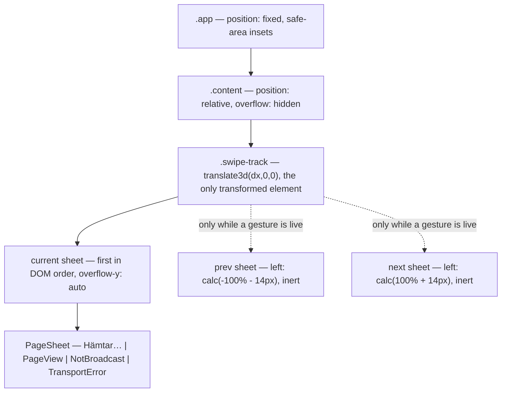
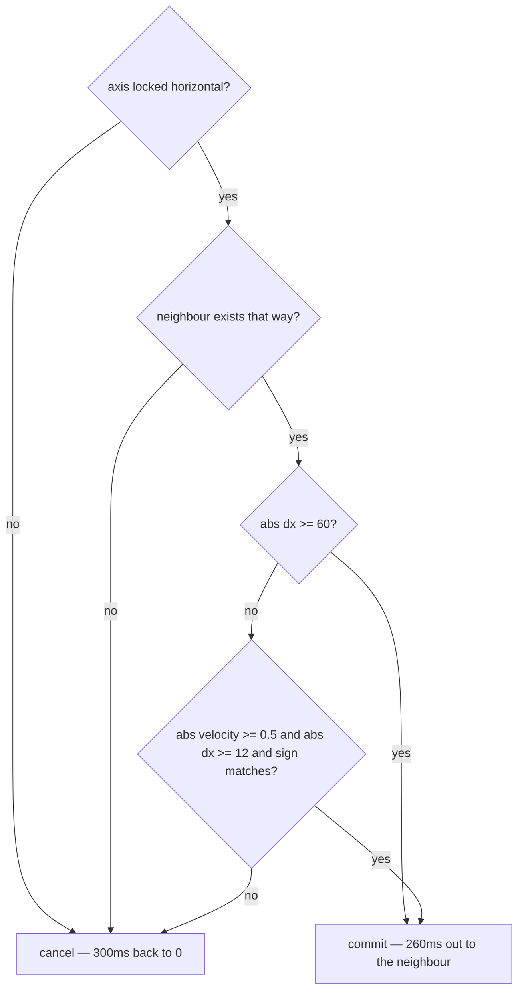

# Swipe Follows the Finger - Plan

## Goal Capsule

- **Objective:** A sideways drag moves the page under the reader's finger, so the gesture shows what it is doing while it is doing it.
- **Means:** A transformable track inside `.content` carrying three sheets across a black gutter, driven by direct `style.transform` writes from the pointer hook (KTD2, KTD5).
- **Authority hierarchy:** `CLAUDE.md` wins on code style, API boundaries and test strategy. `misc/design/README.md` wins on geometry, thresholds, timings and easings. This plan's KTDs win on where the code lives and how it is structured. The requirements below win on behaviour.
- **Execution profile:** Pure maths first in `src/swipe.ts` with unit tests, then structure, then wiring, then app-level tests. The suite cannot see motion; a real-device pass is part of done, not a nicety.
- **Stop conditions:** Stop and report if preserving vertical sub-page scrolling turns out to require `touch-action: pan-y` (see KTD9 and Outstanding Questions), or if the gesture-scoped mount in KTD11 still forces an existing assertion in `src/app.test.tsx` to be edited.
- **Tail ownership:** The invoking pipeline owns commits and shipping. Work happens on `main`; no PR.

---

## Product Contract

### Summary

Give the sideways page-change gesture visual feedback. During a horizontal drag the current page follows the finger 1:1, with the neighbouring page visible across a 14px black gutter. Past the end of the run the page still moves, but damped. On release the sheet snaps — out to the neighbour when the gesture commits, back to centre when it does not. A short fast flick commits where 60px of slow travel would not. Neighbouring pages are prefetched one deep so the sheet beside the finger is usually already drawn.

Nothing else changes. No colour, type, spacing or layout moves, and a reader who never swipes sees no difference. Between gestures the page tree is exactly what it is today: one page.

### Problem Frame

The gesture already works: `src/swipe.ts` decides a direction and `src/useSwipeNavigation.ts` navigates on `pointerup`. But it decides everything at the end. Nothing moves under the finger, so the page appears to change by itself — the reader gets no confirmation that a drag was read as a drag, no sense of how far is far enough, and no way to discover the gesture except by accidentally completing one. `docs/plans/2026-08-25-1857-feat-swipe-between-pages-plan.md` named this out of scope in KTD8. That KTD carries two rulings; this plan reverses its no-visual-affordance half at the user's direction. KTD8's `touch-action` half stands (see KTD9), as does every other decision in that plan.

### Key Decisions

- The page follows the finger, replacing the invisible commit-only swipe (session-settled: user-directed — chosen over KTD8 of `docs/plans/2026-08-25-1857-feat-swipe-between-pages-plan.md` ("no page-following animation, no visual affordance"): the gesture currently reads as the page changing by itself). Governs R1, R2, R3, R4.
- Only KTD8's no-affordance half is reversed; every other decision in the prior plan stands (session-settled: user-directed — chosen over re-opening the prior plan's gesture decisions now that the sheet is transformable: the reversal is scoped to the missing feedback). Governs R14, R15.
- End of the run is damped movement, not refusal (session-settled: user-approved — chosen over refusing the gesture outright: the page should acknowledge the gesture and decline it). Governs R5.
- No "sista sidan" / "första sidan" edge chip and no 44px edge gradient (session-settled: user-directed — chosen over shipping the prototype's edge affordances: they are prototype documentation, not design elements; the resistance alone is the design). Governs R4, R5.
- A not-yet-loaded sheet is a real sheet on the real grid showing `Hämtar…`, not a skeleton (session-settled: user-approved — chosen over a shimmer or skeleton placeholder: `Hämtar…` is the word the app already shows while fetching). Governs R10.
- `prefers-reduced-motion: reduce` falls back to today's behaviour (session-settled: user-approved — chosen over a reduced-duration animation: the honest fallback is the instant change the app already does). Governs R16.

### Requirements

**Following the finger**

- R1. During a horizontal drag the current page moves horizontally by exactly the finger's travel, while a neighbour exists in that direction.
- R2. The previous page sits one full content width plus 14px to the left of the current page; the next page the same distance to the right.
- R3. The 14px gutter is plain black, and each sheet carries a `1px solid #1c1c1c` rule on both sides so its edge reads against the gutter.
- R4. Nothing else is painted during the drag: no indicator, no label, no edge gradient.
- R5. When no neighbour exists in the direction of travel, the sheet still moves, damped to `sign * min(width * 0.16, |travel| * 0.42)`, and no label appears.

**Committing and releasing**

- R6. A gesture commits when the locked axis is horizontal, the neighbour exists, and either `|dx| >= 60` or the gesture is a flick.
- R7. A flick is `|velocity| >= 0.5` px/ms with `|dx| >= 12` and the velocity's sign matching `dx`'s.
- R8. On commit the sheet travels out to the neighbour's position over 260ms `cubic-bezier(.32,.94,.28,1)`; on cancel it returns to centre over 300ms `cubic-bezier(.22,1,.36,1)`. During the drag there is no transition.
- R9. The commit transition ending does not by itself move the sheet. The track holds its commit offset until the render carrying the new page has committed, and only then resets to centre without a transition, so the swap is never visible.
- R17. A pointer pressed during a snap takes over the gesture: the transition is cleared, the sheet's current offset becomes the new gesture's origin, and the page change the snap was going to make is abandoned.

**Neighbour content**

- R10. A neighbour sheet whose page is already known renders that page. A neighbour sheet whose page is not yet known renders the page number and `Hämtar…`, and fills in when the payload arrives with no transition.
- R11. When a page settles, its `prev` and `next` are prefetched. After a commit, one further page in the direction of travel is prefetched. Nothing is prefetched two deep in both directions.
- R12. A gesture never waits on the network.
- R13. While a page is loading, the neighbours of the page being left stay available, so both directions remain navigable and the bottom-bar arrows keep the enabled state they had before the load began.
- R18. Prefetching never costs the reader a page they visited: a prefetched page is written to the store only when it fits, and a store that is full drops the prefetch rather than evicting.
- R19. A neighbour whose prefetch failed is not retained as a result. Its sheet keeps showing `Hämtar…`, and committing onto it enters the ordinary load path, so a real failure surfaces as the page's own transport error.

**Between gestures**

- R20. Between gestures the app renders exactly one page. Neighbour sheets exist only from the moment a gesture locks horizontal until that gesture ends.
- R21. A sheet that is not the current page is inert: outside the tab order and outside the accessibility tree.

**What must not change**

- R14. No `preventDefault` on pointer or touch input, anywhere. `EDGE_GUTTER` still refuses drags that start within 44px of a screen edge. `pointercancel` is still an authoritative abort. The click swallow still behaves as built. The bottom bar keeps every control, position and 44px target it has today, and its disabled states are unchanged except for the loading-window carve-out in R13.
- R15. Vertical scrolling through a page's sub-pages is unaffected: a gesture that locks vertical never moves the sheet sideways.
- R16. Under `prefers-reduced-motion: reduce` there is no track transform and no neighbour sheets at any point; the page changes on commit, as today.

### Acceptance Examples

- AE1. Covers R1, R6. Given page 330 with both neighbours, when the reader drags 80px left and lifts, then the sheet tracks the finger during the drag and 331 is shown afterwards.
- AE2. Covers R6, R7. Given page 330, when the reader drags 40px left slowly and lifts, then the sheet returns to centre and 330 is still shown. When the reader instead flicks 20px left at 0.8px/ms, then 331 is shown.
- AE3. Covers R5. Given a page whose `nextPage` is empty, when the reader drags 100px left, then the sheet moves 42px and returns on release, with no label shown.
- AE4. Covers R15. Given page 331 and its fourteen sub-pages, when the reader drags 20px sideways and 60px down, then the sheet does not move sideways and the page does not change.
- AE5. Covers R9. Given a committed drag, when the commit transition ends, then the track stays at the commit offset until the new page has rendered, and is at rest with no transition once it has.
- AE6. Covers R20. Given any page at rest, when nothing is being dragged, then the document contains one page's frames and no `Hämtar…` for a neighbour.

### Scope Boundaries

**In scope**

- The transform layer inside `.content`, its thresholds, timings and easings.
- One-deep neighbour prefetch and the loading sheet.
- The reduced-motion fallback.

**Deferred to follow-up work**

- Switching `.content` to `touch-action: pan-y`. It needs a real device to justify — see Outstanding Questions.
- Momentum beyond the single flick threshold (rubber-banding with velocity carry-over, multi-page throw).

**Outside this feature**

- Any edge chip, label, gradient or progress indicator (Key Decisions).
- Any change to the bottom bar, the rail, the freshness bar, or the teletext rendering itself.

### Outstanding Questions

- Q1 (deferred). Does `touch-action: auto` let the browser start a vertical scroll and fire `pointercancel` often enough to break legitimate horizontal drags on a long page? Only a real device answers this. Ship `auto`; if the device pass shows it, `pan-y` is the follow-up, and the Android back gesture must then be re-verified at 40dp sensitivity.
- Q3 (deferred). Does a neighbour sheet mounted at the axis lock paint before it crosses the gutter into view, or does a cached neighbour still flash `Hämtar…` for a frame? KTD11 accepts one frame of risk here to keep the resting tree at one page; the device pass measures it. If it reads badly, mounting at `pointerdown` instead of at the lock is the fallback, at the cost of mounting on every tap.

### Assumptions

- A1. `readPage()` / `writePage()` in `src/pageStore.ts` are the prefetch's storage. Prefetch writes the same shape a navigation writes, so a prefetched page paints from cache on arrival exactly as a revisited page does — subject to R18, which forbids a prefetch from evicting.
- A2. The existing msw handler answers unknown page numbers with a synthetic `status: 'fail'`, so prefetching a page with no fixture does not trip `onUnhandledRequest: 'error'`. U3's execution note verifies this against the whole suite rather than assuming it.
- A3. The 260ms and 300ms timings were tuned in a prototype that drew a lightweight teletext page. They have not been observed against real decoded 40x24 grids. They are the starting values, and the device pass is where they are confirmed or adjusted.

### Sources

- `misc/design/README.md` — the design handoff; authoritative for geometry, thresholds, timings and easings.
- `misc/design/Swipe page.dc.html` — the prototype's gesture core (damping, velocity smoothing, commit rule). Reference for behaviour only; its renderer and its `setTimeout` swap are explicitly not the target.
- `docs/plans/2026-08-25-1857-feat-swipe-between-pages-plan.md` — KTD1 through KTD9 of the shipped gesture.
- `docs/solutions/best-practices/synthetic-events-produce-no-follow-on-events.md` — happy-dom synthesises no follow-on events, runs no CSS transitions, and performs no layout.
- `docs/plans/2026-08-23-2021-fix-hairline-seams-in-decoded-frame-plan.md` — the `0.5px` bleed that closes sub-pixel seams in a decoded frame; relevant because a fractional track offset puts the whole grid on a non-integer position.

---

## Planning Contract

### Key Technical Decisions

- KTD1. **The gesture maths stays pure and moves wholly into `src/swipe.ts`.** The module gains `startsInGutter`, `lockAxis`, `smoothVelocity`, `dampedOffset` and a flick term on `swipeDirection`, all over plain numbers. The hook keeps no arithmetic. This follows KTD6 of the prior plan and is the only way the damping curve and the flick boundary are testable at all, since happy-dom reports every rect as zero-size. (session-settled: user-approved — chosen over sampling time and geometry inside the hook: keeps the module unit-testable.) Governs R5, R6, R7.

- KTD2. **`dx` is written straight to the track's `style.transform` through a ref; React never sees it.** `useSwipeNavigation` holds the whole gesture in a ref, as it already does, and writes the transform on each `pointermove`. React owns only the mount at the axis lock and the page swap. (session-settled: user-directed — chosen over holding `dx` in `useState` as the prototype does: a state write per `pointermove` re-renders the whole page tree, including up to fourteen decoded sub-page frames.) Governs R1.

- KTD3. **The scroll container moves from `.content` down to each sheet.** `.content` becomes `position: relative; overflow: hidden`, the track fills it, and each sheet is an absolutely-positioned, full-size box with its own `overflow-y: auto`. The alternative — keeping `.content` scrolling and pinning neighbours to the track's top — leaves a neighbour sheet hanging above the viewport whenever the reader has scrolled down, which is exactly the case a 14-sub-page page produces. Moving the scroll down costs one invariant: `.content`'s "the only scroll container in the app" comment must be rewritten to name the sheet. `--frame-budget` is unaffected, because the content area's height does not change. A sheet's scroll position never has to be reset, because KTD12 keys sheets by page number, so a page that becomes current arrives in a fresh node scrolled to its own top. Governs R2, R15.

- KTD4. **Sheet offsets are expressed in CSS, not measured in JavaScript.** Prev sits at `left: calc(-100% - 14px)`, next at `calc(100% + 14px)`, and the commit target is `translate3d(calc(∓100% ∓ 14px), 0, 0)` on the track. Percentages resolve against the track's own width, so no code reads a width to lay the sheets out or to animate the commit. The single exception is the damping ceiling in R5, which needs a number: it is the track's `clientWidth`, read once at `pointerdown` into the gesture ref and never re-read during the gesture. Reading it per `pointermove` would force a synchronous layout on every move of the gesture this feature exists to smooth, and the window's width is the wrong box once safe-area insets apply.

- KTD5. **The commit transition ending starts the page change; the render carrying the new page ends it.** The track's `transitionend` — and `transitioncancel`, treated identically — calls `navigate`. It does not reset the transform. The reset happens in a layout effect keyed on the page number, after the render that carries the new page has committed. This is what makes the swap invisible: navigation goes through the URL hash, so `navigate` only assigns `window.location.hash` and a listener applies it a frame or more later. Resetting in the `transitionend` handler would paint the outgoing page snapped back to centre in between. When the commit transition would have zero delta, `navigate` is called synchronously instead, so a transition that never fires cannot park the sheet. (session-settled: user-directed — chosen over the prototype's `setTimeout`: a timeout drifts from the animation and the handoff names it as what a real implementation should not do.) Governs R9.

- KTD6. **The axis locks once, at the first movement past 6px on either axis, and is then held.** A vertical lock ends the gesture immediately, before the track has moved. This is what keeps sub-page scrolling intact once the sheet is transformable. (session-settled: user-approved — chosen over re-deciding the axis on every move: a re-deciding gesture can start moving the sheet mid-scroll.) Governs R15.

- KTD7. **End of gesture is idempotent, and `window` carries the rescue listeners.** `pointerup`, `pointercancel` and `blur` on `window` all route to the same end-of-gesture path as the element's own `pointerup`, and that path clears the gesture ref before doing anything else, so a doubled event is a no-op. This matters twice over: a lift outside `.content` otherwise parks the sheet off-centre, and the existing tests dispatch bubbling events on `main` that also reach `window`. `pointercancel` keeps KTD1's meaning from the prior plan — an authoritative abort — and now animates the track back to centre rather than only clearing state. (session-settled: user-approved — chosen over relying on the element's own `pointerup`: a missed `pointerup` reads as a broken app.) Governs R14.

- KTD8. **Neighbour content is state on `useTextTv`, not a `pageStore` read during render.** A prefetch effect resolves `prev` and `next` — from cache when present, from the network otherwise — and stores their results alongside the current page. Reading `readPage()` at render time would put a synchronous `JSON.parse` of a base64 GIF in the render path for every neighbour of a fourteen-sub-page page. Two rules keep the state honest across a page change. The outgoing page's result seeds the reverse neighbour at commit, so the page just left is never `Hämtar…` on a back-and-forth swipe. And the previous page's neighbours are held through the loading window rather than cleared with the result, which is what makes R13 true. Governs R10, R11, R12, R13.

- KTD9. **`touch-action` on `.content` stays absent.** KTD8 of the prior plan rejected `pan-y` because Chrome then registers a system-gesture-exclusion rect over the element and suppresses the Android back gesture, contradicting that plan's KTD4. That reasoning is untouched by this work, so the declaration stays off and the device pass measures whether it needs to change. (session-settled: user-directed — chosen over declaring `touch-action: pan-y` to protect the 1:1 follow: the Android back gesture is the more expensive thing to lose, and the handoff says try `auto` first.) Governs R14, R15. See Q1.

- KTD10. **A new `PageSheet` component carries the four render states; `App` composes up to three of them.** `App` currently branches between `Hämtar…`, `PageView`, `NotBroadcast` and `TransportError` inline. That branch becomes `PageSheet`, used once for the current page and once for each neighbour while a gesture is live. Neighbour sheets reach only three of the states — a failed neighbour prefetch is discarded rather than shown as an error the reader cannot act on (R19). This differs from the handoff's file table, which expected the change inside `PageView`; `PageView` renders one page's sub-pages and is the wrong level for the state branch.

- KTD11. **Neighbour sheets mount at the axis lock and unmount at the end of the gesture.** Between gestures the tree holds exactly one page. Two things forced this. The existing app-level tests count frames across the whole document — `getAllByRole('group')` and `document.querySelectorAll('.text-frame')` — so around thirty `drawnFrames(1)` assertions would break the moment a second page rendered, and two more assert `Hämtar…` is absent. And a permanently mounted pair of neighbours triples the decoded-frame cost this feature is otherwise careful about: page 331 has fourteen sub-pages, so three mounted sheets is up to 42 canvas decodes held at rest instead of 14, on the phones KTD2's argument is about. Mounting at `pointerdown` instead would pay that cost on every tap. Governs R20. See Q3 for the cost this defers to the device pass.

- KTD12. **Sheets are a keyed list, keyed by page number, not three positional slots.** Each sheet's place is a class derived from its role; React matches sheets by page. Without this, the swap re-renders the centre slot with the new page's props, and `SubPageFrame` deliberately keeps painting its previously resolved rows until the new `decodeFrame` promise settles — so the reader would see the page they just swiped away, at rest, in the centre. Keying by page reuses the already-decoded neighbour subtree as the new current sheet, so nothing re-decodes at the swap and each page's sheet keeps its own scroll position. Governs R9.

- KTD13. **The current sheet renders first in DOM order.** Sheets are placed by `left`, so source order is free. It is not free in the tests: `giveTheFrameALayout` stubs the rect of `document.querySelector('.hotspots')`, the first match in document order, and the four hotspot tests plus the click-swallow test depend on that being the page they click. Rendering prev first would silently point the stub at a page nobody touches.

- KTD14. **A native scroll-snap carousel was considered and rejected.** `overflow-x` with `scroll-snap-type: x mandatory` gives 1:1 following, momentum, rubber-banding and snapping for free. It is rejected for two reasons this plan cannot trade away: it claims horizontal panning from the browser exactly as `pan-y` does, re-opening the Android back-gesture conflict KTD9 exists to avoid; and a scroll container cannot refuse a drag that starts in the 44px edge gutter, which R14 requires. The hand-built transform layer is the price of keeping both.

### High-Level Technical Design

**Where the track sits.** At rest the track holds one sheet; the neighbours below appear only between the axis lock and the end of the gesture.

**The gesture's states.** The track is only ever transformed in `dragging` and the two snap states.

```mermaid
stateDiagram-v2
  [*] --> idle
  idle --> pending: pointerdown, touch, primary, outside the 44px gutter
  pending --> dragging: first move past 6px, horizontal by 1.5x — neighbour sheets mount here
  pending --> idle: first move past 6px, vertical — gesture abandoned, track never moved
  pending --> idle: second pointer, pointercancel, or end of gesture
  dragging --> committing: end of gesture and the commit rule passes
  dragging --> cancelling: end of gesture otherwise, or pointercancel
  committing --> awaitingRender: transitionend or transitioncancel — navigate, transform held
  awaitingRender --> idle: the render carrying the new page commits — reset transform, unmount neighbours
  cancelling --> idle: transition runs to 0; no swap; unmount neighbours
  committing --> pending: pointerdown — take over the snap, abandon the pending page change
  cancelling --> pending: pointerdown — take over the snap
```

**What decides a commit.** Evaluated once, at end of gesture, from values the ref already holds.

### Implementation Constraints

- happy-dom performs no layout: every `getBoundingClientRect()` and `offsetWidth` is zero. Any test that needs a width must supply it, as `giveTheFrameALayout` in `src/app.test.tsx` already does.
- happy-dom runs no CSS transitions, so `transitionend` never fires on its own. Tests that need the swap must dispatch it.
- happy-dom synthesises no follow-on events — no compatibility click from a pointer chain, no `pointercancel`, no `blur`. Every event in a chain must be dispatched by hand, and each new guard must be proved by deleting it and watching the test go red.
- `matchMedia` exists in happy-dom and reports `(prefers-reduced-motion: reduce)` as false, so the fallback branch is only reachable in tests by stubbing it.
- The existing app-level helpers count across the whole document. `frames()` is `getAllByRole('group')`, `textFrames()` is `document.querySelectorAll('.text-frame')`, and `drawnFrames(n)` asserts both have exactly `n`. This is the constraint KTD11 answers.
- `src/test/setup.ts` runs msw with `onUnhandledRequest: 'error'`, so prefetch adds real requests to every existing app-level test, and `writePage` adds localStorage writes to tests that assert on eviction and on the `texttv:fetched` index.
- A fractional `translateX` puts the whole decoded grid on a non-integer offset, which is the condition that produced the hairline seams fixed in `docs/plans/2026-08-23-2021-fix-hairline-seams-in-decoded-frame-plan.md`. Do not add any scale to the track — KTD3 of that plan notes the `0.5px` bleed doubles under `scaleY(2)`.

### Sequencing

U1 is pure and lands first. U2 builds the track, the sheets and `PageSheet`. U3 fills the neighbour sheets and depends on U2 for `PageSheet`. U4 needs the track and the sheets from U2, and reads neighbour *existence* from the `prev`/`next` values `App` already passes the hook — so it does not wait on U3. U3 and U4 are siblings after U2. U5 asserts what spans them.

---

## Implementation Units

### U1. Gesture maths in `src/swipe.ts`

**Goal:** Every number the gesture needs, in one pure module, unit-testable without a DOM.

**Requirements:** R5, R6, R7. Implements KTD1.

**Dependencies:** none.

**Files:** `src/swipe.ts`, `src/swipe.test.ts`.

**Approach:**

1. Add `SWIPE_FLICK_VELOCITY = 0.5`, `SWIPE_FLICK_MIN_DISTANCE = 12`, `SWIPE_AXIS_LOCK = 6`, `SWIPE_GUTTER_PX = 14`, `SWIPE_DAMP_RATIO = 0.42` and `SWIPE_DAMP_CEILING = 0.16`, each with the reasoning above it in the block-comment style the file already uses. `SWIPE_GUTTER_PX` is the single source for the 14px gutter; the CSS `calc()` in U2 must read it through a custom property rather than repeating the literal.
2. Extract the existing edge test into an exported `startsInGutter(x, viewportWidth)` and have `swipeDirection` call it, so the hook can refuse to move the track at `pointerdown` without duplicating `EDGE_GUTTER`.
3. Add `lockAxis(dx, dy)` returning `'x' | 'y' | undefined` — `undefined` below `SWIPE_AXIS_LOCK` on both axes, otherwise the existing `SWIPE_AXIS_RATIO` dominance test.
4. Add `smoothVelocity(previous, dxSample, dtSample)` applying `previous * 0.4 + (dxSample / max(8, dtSample)) * 0.6`. The floor on `dt` is what makes the function safe in a test environment that reports 0ms between synchronous events.
5. Add `dampedOffset(travel, trackWidth)` returning `sign(travel) * min(trackWidth * SWIPE_DAMP_CEILING, |travel| * SWIPE_DAMP_RATIO)`. Name the parameter `trackWidth`, not `viewportWidth` — KTD4 pins it to the track's box.
6. Give `swipeDirection` a fourth **optional** `velocity` parameter and the flick term from R7. Optional is load-bearing: all nine existing tests call it with three arguments and one asserts the three constants literally, and the prior plan's Definition of Done forbids editing an existing assertion.

**Patterns to follow:** the module's existing shape — plain numbers in, a narrow union out, no DOM, no clock. `src/imageMap.ts` is the wider precedent.

**Test scenarios:**

- `smoothVelocity` with `dtSample` of 0 returns a finite number (the 8ms floor), and does not divide by zero.
- `smoothVelocity` weights the new sample at 0.6 and the carried value at 0.4: from a previous of 0 and a 10px sample over 10ms, the result is 0.6.
- `dampedOffset(100, 390)` returns 42 — the ratio binds below the ceiling.
- `dampedOffset(300, 390)` returns 62.4 — the ceiling binds, exactly `390 * 0.16`.
- `dampedOffset(-100, 390)` returns -42 — the sign is carried.
- `lockAxis(3, 3)` returns `undefined`; `lockAxis(10, 2)` returns `'x'`; `lockAxis(2, 10)` returns `'y'`; `lockAxis(10, 8)` returns `'y'` — 10 is below 1.5 × 8, so dominance still decides once the lock threshold is passed.
- `swipeDirection` called with three arguments behaves exactly as today: the nine existing tests stay untouched and green.
- Flick boundary: 20px of travel with velocity -0.8 returns `'next'`; the same travel with velocity -0.4 returns `undefined`; the same travel with velocity +0.8 returns `undefined` (the sign does not match, so a reversal at the end of a drag does not commit the way it was moving).
- Flick distance boundary: 11px at -0.8 returns `undefined`; 12px at -0.8 returns `'next'`.
- A gesture starting inside the 44px gutter still returns `undefined` however fast it is — `startsInGutter` is tested before the flick term.

**Verification:** `npm test` passes with the nine existing `src/swipe.test.ts` assertions unedited. Each new boundary test goes red when its guard is deleted.

---

### U2. The track, the sheets and the gutter

**Goal:** The DOM and CSS a transform can act on, with sub-page scrolling preserved, one page at rest, and reduced motion falling back to today.

**Requirements:** R2, R3, R4, R15, R16, R20, R21. Implements KTD3, KTD4, KTD10, KTD11, KTD12, KTD13.

**Dependencies:** U1 (for `SWIPE_GUTTER_PX`).

**Files:** `src/App.tsx`, `src/components/PageSheet.tsx`, `src/index.css`, `src/app.test.tsx`.

**Approach:**

1. Extract `App`'s inline four-way branch (`Hämtar…` / `PageView` / `NotBroadcast` / `TransportError`) into `src/components/PageSheet.tsx`, taking the page number and the result. Behaviour is identical for the current page; this is a move, not a rewrite.
2. In `App`, wrap the sheets in a track element and hold a ref to it for U4. Render the sheets as a keyed list keyed by page number (KTD12), with the current sheet first (KTD13) and its role driving its position class.
3. Hold a boolean for "a gesture is live", set by the hook at the axis lock and cleared at the end of the gesture. Neighbour sheets render only while it is true (KTD11). Everything else about the tree is unchanged from today.
4. Give every sheet that is not the current page `inert`, which removes it from both the tab order and the accessibility tree. The attribute moves with the swap.
5. Read `prefers-reduced-motion` through `matchMedia` once at mount. No requirement asks for a mid-session flip to take effect, so do not subscribe to `change`. Under reduced motion the hook is told motion is off and no neighbour ever mounts.
6. `.content` becomes `position: relative; overflow: hidden`. Rewrite the "the only scroll container in the app" comment to name the sheet instead — the invariant moves, it does not disappear.
7. `.swipe-track` fills `.content` absolutely, carries `will-change: transform`, and starts with no transition.
8. `.swipe-sheet` is `position: absolute; top: 0; width: 100%; height: 100%; overflow-y: auto`, with `border-left` and `border-right` of `1px solid #1c1c1c`. The prev and next sheets take `left: calc(-100% - var(--swipe-gutter))` and `calc(100% + var(--swipe-gutter))`, with `--swipe-gutter` set from `SWIPE_GUTTER_PX`.
9. Confirm rather than move the frame centring: `.pages` already renders inside whichever sheet holds it, so its `max-width: var(--frame-max); margin-inline: auto` resolves per sheet with no change. Verify the frame is still centred at its `--frame-max` width.

**Patterns to follow:** `.rail`'s `1px solid #1c1c1c` for the hairline. The stylesheet's existing comment style for the scroll-container invariant.

**Test scenarios:**

- The current page still renders identically for each of the four states: loading, page, not broadcast, transport error. The existing app tests covering those states pass unedited.
- At rest the document contains exactly one page's frames — `drawnFrames(1)` on a single-sub-page page and `drawnFrames(14)` on 331 both still hold, unedited.
- At rest no `Hämtar…` appears for a neighbour on a settled page.
- Under a stubbed `matchMedia` reporting `(prefers-reduced-motion: reduce)` as true, no neighbour sheet mounts even mid-gesture.
- The current sheet is the first `.swipe-sheet` in document order, and the first `.hotspots` in the document belongs to it.
- A sheet that is not the current page carries `inert`; the current one does not.
- Page 331's fourteen sub-pages all render inside the current sheet, and the sheet is the element carrying the scroll — not `.content`.

**Verification:** `npm run build` is clean. `npm test` green with no existing assertion edited. Visually in `npm run dev`: page 331 scrolls through fourteen sub-pages, the rail still scrolls sideways, and the frame is still centred at its `--frame-max` width.

---

### U3. Neighbour content and one-deep prefetch

**Goal:** The sheet beside the finger shows a real page when the app knows one, and `Hämtar…` on the real grid when it does not — without costing the reader a cached page or a working test.

**Requirements:** R10, R11, R12, R13, R18, R19. Implements KTD8.

**Dependencies:** U2.

**Files:** `src/useTextTv.ts`, `src/pageStore.ts`, `src/App.tsx`, `src/components/PageSheet.tsx`, `src/app.test.tsx`.

**Approach:**

1. Add neighbour results to what `useTextTv` returns, one for `prev` and one for `next`. `undefined` means not yet known, which is what makes `PageSheet` render the loading state.
2. Add a prefetch effect that runs when the current page settles: for each neighbour, paint from `readPage()` when it is there, otherwise fetch and store. Keep its own in-flight `Set` — the existing `inFlight` ref holds one page number and belongs to the visibility-change revalidation guard.
3. Give `writePage` a prefetch mode that never evicts: on a quota failure for a page the reader did not ask for, give up rather than dropping visited pages (R18). A prefetched page is a convenience; a cached visited page is the offline story.
4. Discard a failed prefetch rather than retaining it (R19). Committing onto that page then enters the ordinary load path, so the reader sees the page's own transport error rather than a permanent `Hämtar…`.
5. Seed the reverse neighbour from the outgoing result at commit, so paging 330 → 331 leaves 330 immediately available as 331's `prev` rather than briefly `Hämtar…`.
6. Hold the previous page's neighbours through the loading window instead of clearing them with the result (R13), so both directions stay navigable and the bar arrows keep the enabled state they had.
7. After a commit, prefetch one further in the direction of travel. Nothing goes two deep in both directions; a page's neighbours are only known from its own payload, so a symmetric two-deep prefetch is a second sequential round-trip for the rarer case.
8. Prefetch never writes the current page's loading state and never blocks navigation — a gesture that lands on a page still arriving shows the loading sheet and stays draggable.
9. The loading sheet is the page number in `--ink` where the header row goes and `Hämtar…` in `--dim` where the body goes, reusing `message__text`. No shimmer, no skeleton; it fills in behind with no transition.

**Execution note:** Wire the prefetch behind a flag and run the **whole** suite before building the rest of the unit. Two existing surfaces are exposed: msw's `onUnhandledRequest: 'error'` (A2), and the eviction and `texttv:fetched` assertions in the cache tests, which step 3 exists to protect. If a page with no fixture does error, that is a `src/test/server.ts` gap to fix, not a reason to weaken the msw setting.

**Test scenarios:**

- Settling on page 330 issues exactly two extra requests, for its `prev` and its `next`, and no more.
- Settling on a page whose `prevPage` is `""` issues one extra request, not two.
- A neighbour already in `pageStore` is painted without a request.
- The neighbour sheet for a page not yet known shows the page number and `Hämtar…`, and shows the page once the payload arrives.
- Immediately after committing 330 → 331, the `prev` sheet shows 330 rather than `Hämtar…`.
- Navigating 330 → 331 prefetches 332, and navigating back 331 → 330 issues no new request because both are cached.
- A prefetch that would need to evict a stored page stores nothing, and the previously stored pages all survive.
- A neighbour whose prefetch fails is not retained; committing onto it shows the transport error, not `Hämtar…`.
- A page that is still loading keeps the bar arrows in the enabled state they had before the load, and a swipe during the load still commits.
- The existing cache tests — the eviction test that seeds eight pages, and the visibility-revalidation tests that manipulate `texttv:fetched` — pass unedited with prefetch on.

**Verification:** `npm test` green with no existing assertion edited. In `npm run dev` against the mock, the network panel shows two prefetches after a page settles and none on an immediate return to a visited page.

---

### U4. The hook drives the track

**Goal:** The gesture becomes a value tracked during the drag rather than a decision made at the end.

**Requirements:** R1, R5, R6, R7, R8, R9, R14, R16, R17, R20. Implements KTD2, KTD5, KTD6, KTD7, KTD11.

**Dependencies:** U1, U2.

**Files:** `src/useSwipeNavigation.ts`, `src/App.tsx`, `src/app.test.tsx`.

**Approach:**

1. Take the track ref alongside the container ref, a flag for whether motion is allowed, and a callback that tells `App` a gesture is live. When motion is off, the hook behaves exactly as it does today — no transform, no axis lock, decision at `pointerup`.
2. Widen the gesture ref to hold the locked axis, the last sample's `x` and timestamp, the smoothed velocity, `dx`, and the track width read once at `pointerdown`. None of it is React state.
3. On `pointerdown`, refuse the gesture when `startsInGutter` says so, so the track never moves for an edge-started drag. Keep the existing order: touch only, second-pointer abort before `isPrimary`. When a snap is in flight, take it over instead: clear the transition, read the current computed offset as the new gesture's origin, and abandon the page change the snap was going to make (R17).
4. On `pointermove`, lock the axis once with `lockAxis` and abandon immediately on a vertical lock. On a horizontal lock, tell `App` the gesture is live so the neighbour sheets mount. Once horizontal, update the smoothed velocity with `smoothVelocity` and write `translate3d(<dx>px,0,0)` to the track, passing `dx` through `dampedOffset` when the neighbour in that direction is absent.
5. On end of gesture, evaluate `swipeDirection` with the smoothed velocity. On commit, set the 260ms transition and the `calc`-expressed target; on cancel, set the 300ms transition and a target of 0.
6. On the track's `transitionend` — and `transitioncancel` — call `navigate`, and leave the transform where it is. When the commit target equals the current offset, call `navigate` synchronously instead, since no transition will fire.
7. Reset the transform and clear the transition in a layout effect keyed on the page number, then clear the gesture-live flag so the neighbours unmount. This is the half of KTD5 that makes the swap invisible under hash routing.
8. Bind `pointerup`, `pointercancel` and `blur` on `window` as well. Route every one to the same end-of-gesture function, which clears the gesture ref first so a doubled event is a no-op. Remove all of them in the effect's cleanup.
9. `pointercancel` cancels back to 0 — never commits — and now animates rather than only clearing state.
10. Nothing calls `preventDefault`. Listeners stay `{ passive: true }`.

**Test scenarios:**

- A 40px drag left writes `translate3d(-40px, 0, 0)` to the track during the move, before any lift.
- The neighbour sheets are absent before the axis lock and present after it, and absent again once the gesture ends.
- On a page with no next neighbour, a 100px drag left writes the damped `-42px`, not `-100px`, using the width read at `pointerdown`.
- A vertical-dominant first move leaves the track's transform untouched for the rest of the gesture, even when later moves are horizontal, and mounts no neighbour.
- A drag starting within 44px of the edge leaves the track's transform untouched.
- On commit, the track carries the 260ms transition and the commit target; dispatching `transitionend` navigates but leaves the transform at the commit target; once the new page renders, the transform and the transition are both cleared.
- On cancel, the track carries the 300ms transition and a target of 0, and the page does not change.
- A `pointerdown` during a commit snap clears the transition, starts a new gesture from the current offset, and the page change the snap had queued does not happen.
- `pointercancel` mid-drag sets the cancel transition and a target of 0, and does not navigate.
- A `pointerup` dispatched on `window` after a `pointerdown`/`pointermove` on `main` ends the gesture exactly once — the page changes once, not twice.
- A `blur` on `window` mid-drag ends the gesture and cancels back to 0.
- Under a stubbed reduced-motion match, a committing drag changes the page and writes no transform at all.
- Every existing swipe assertion in `src/app.test.tsx` passes unedited.

**Verification:** `npm test` green with no existing assertion edited. Each new guard proved by deletion.

---

### U5. Cross-cutting assertions and test scaffolding

**Goal:** The shared helpers the other units' tests need, plus the assertions that span them.

**Requirements:** R9, R14, R20, and the round trip that no single unit owns.

**Dependencies:** U1, U2, U3, U4.

**Files:** `src/app.test.tsx`.

**Approach:**

1. Add one `describe` block in Swedish, with `// R<N>` comments above each test, following the file's existing convention. U2, U3 and U4 each write their own listed scenarios into this file as they land; this unit adds only what spans them.
2. Add a sibling to `swipeFrom` that dispatches several `pointermove` events with controlled timestamps, so a flick is expressible. Do not edit `swipeFrom`'s current behaviour; the existing tests depend on its exact three-event shape.
3. Hoist a layout stub for the track the way `giveTheFrameALayout` was hoisted, giving the track a non-zero width so the damping assertions have something to measure against.
4. Add a `matchMedia` stub with `afterEach` restoration, following the `window.innerWidth` precedent in the existing gutter test.
5. Assert the full drag-to-swap round trip: drag, lift, `transitionend`, the new page renders, and the track is at rest with the neighbours unmounted.
6. Assert the regressions this feature could plausibly break: a committed swipe still swallows the following click; the bar arrows, the home button and the page-number input all still work after a swipe with their disabled states unchanged.

**Test scenarios:** as enumerated in step 5 and step 6. The per-unit scenarios live with their units.

**Verification:** `npm test` green. Every new test goes red when its guard is deleted.

---

## Verification Contract

| Gate | Command | What it proves |
| --- | --- | --- |
| Suite | `npm test` | The pure maths, the wiring, the prefetch, the mount lifecycle, and the reduced-motion branch. No existing assertion edited. |
| Types and build | `npm run build` | `tsc -b` plus the production build, clean. |
| Mock run | `npm run mock` then `npm run dev` | Prefetch count after a settle; the gutter and hairlines against a real layout. |
| Device pass | The dev server on a real phone | Everything the suite structurally cannot see. |

**The device pass must cover:**

- Scrolling page 331's fourteen sub-pages with the sheet never moving sideways.
- A flick that commits and a slow 40px drag that does not.
- Dragging past the end of the run: the sheet moves and resists, with no label.
- Q3's measurement: whether a cached neighbour is painted before it crosses the gutter into view, or flashes `Hämtar…` for a frame.
- Whether the 260ms and 300ms timings still read well against real decoded grids (A3).
- The OS back gesture still working from both screen edges, and on Android at 40dp back sensitivity.
- Lifting the finger outside `.content` and outside the window: the sheet is never left parked off-centre.
- Pressing again mid-snap and dragging back the other way.
- The gutter and the sheet hairlines reading as two separate sheets, and no hairline seams opening inside the decoded grid at a fractional offset mid-drag.
- Q1's measurement: how often `pointercancel` kills a legitimate horizontal drag on a long page with `touch-action` absent.

---

## Definition of Done

**Global**

- R1 through R21 are each asserted in the suite or listed below as device-verified.
- `npm test` and `npm run build` are both green.
- No existing assertion in `src/swipe.test.ts` or `src/app.test.tsx` is edited. Adding a helper is not an assertion edit; changing what an existing `expect` asserts is.
- No dependency added.
- Nothing from an abandoned approach is left in the diff.
- `.content`'s scroll-container comment names the sheet, so the moved invariant is documented where it now lives.

**Device-verified rather than asserted**

R3 and R4 (the gutter and hairlines against a real screen), R5's feel, R8's timings, R14's edge gutter against a real screen edge and OS gesture, R15's real scrolling as opposed to the axis arithmetic U1 pins. happy-dom performs no layout and runs no transitions; it can prove the decision function and the wiring, and nothing about how the motion reads.

**Per unit**

- U1: the boundary tests pin the flick threshold, the flick distance, the sign rule, the damping ratio and its ceiling, and the axis lock.
- U2: the four render states are unchanged, the resting document holds one page, the reduced-motion branch mounts no neighbour, the current sheet is first in DOM order, and 331 scrolls inside its sheet.
- U3: the prefetch count is exactly two after a settle and one after a commit; a prefetch never evicts; the loading sheet shows `Hämtar…`; the page just left is immediately available as the reverse neighbour.
- U4: the transform is written during the move, the damping applies at the end of the run, the neighbours mount at the lock and unmount at the end, and the transform survives `transitionend` until the new page renders.
- U5: the block is in Swedish, uses the file's existing helpers, and carries `// R<N>` comments.

---

## Risks

- **The moved scroll container.** `.content`'s `overflow-y` moving into the sheet is the largest structural change here. `--frame-budget`, the rail's `overscroll-behavior-x`, and the visual-viewport offset all sit near it. Mitigated by U2 landing on its own and being checked in the browser before U4 gives anything a reason to move.
- **The gesture-scoped mount.** KTD11 buys the resting tree back at the cost of doing React work at the axis lock, on the first frames of a gesture that must feel immediate. Mitigated by mounting once per gesture rather than per move, and measured at Q3.
- **`pointercancel` while the track is offset.** With `touch-action` absent the browser can start a vertical scroll mid-drag and cancel the pointer. KTD7 makes that a spring-back rather than a freeze, but how often it fires is unknown until the device pass — Q1.
- **Prefetch inside the existing suite.** Two extra requests and two extra store writes per settle land in every app-level test. U3's execution note runs the whole suite behind a flag before the unit is built out.
- **Hairline seams at fractional offsets.** A `translateX` of a non-integer number of pixels puts the decoded grid off the pixel lattice, which is the condition the `0.5px` bleed was introduced to survive. It should hold, but only a device mid-drag proves it.
- **`transitionend` in a backgrounded tab.** A tab hidden mid-commit may never deliver the event. `transitioncancel` covers the common case; if the device pass finds a parked sheet, the fix is to also end the gesture on `visibilitychange`.
