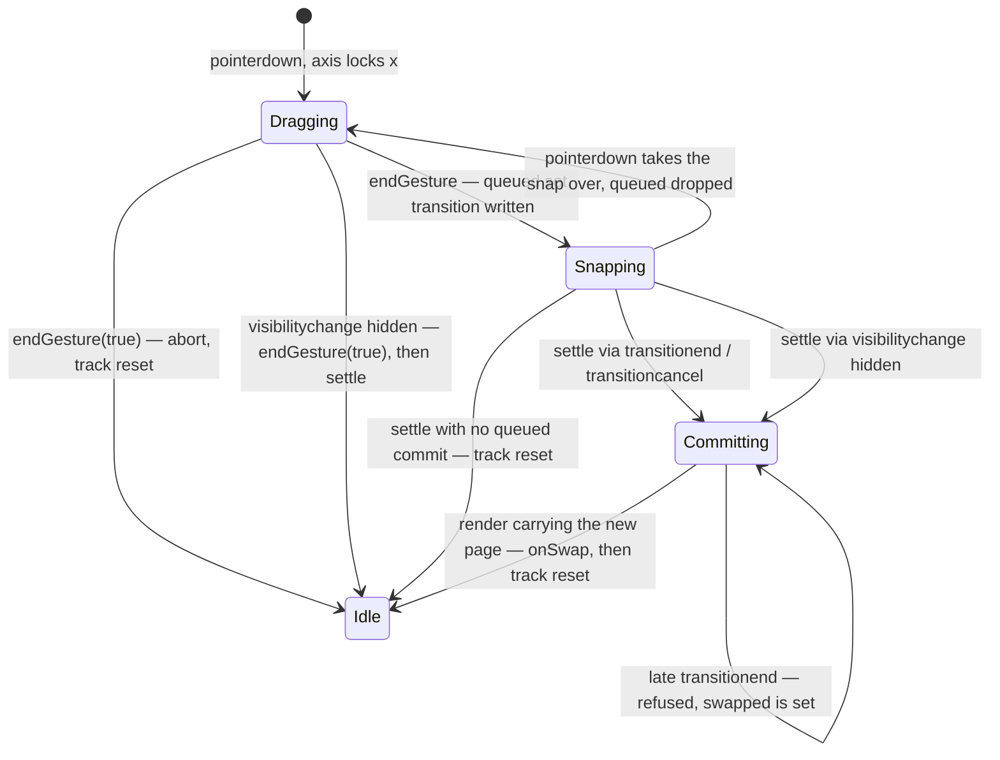
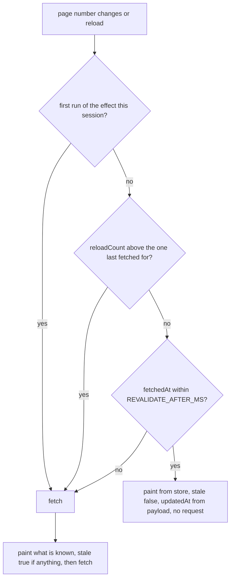
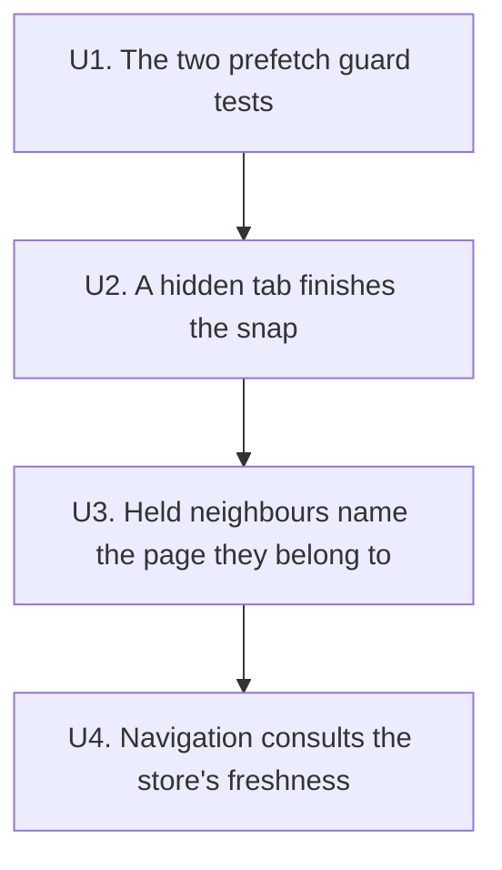

# Swipe Hardening - Plan

## Goal Capsule

- **Objective:** The swipe gesture is honest about three things it currently gets wrong — it does not re-fetch a page it already has, it cannot leave a sheet parked when the tab is hidden, and a neighbour sheet always names a neighbour of the page on screen. The prefetch's StrictMode re-arm is held by a test that fails without it.
- **Means:** Four small changes inside the two hooks that own the gesture and the page — one guard test, a `visibilitychange` edge into the snap's completion path, a page-keyed held-neighbour pair, and a freshness window on the load effect (KTD1, KTD3, KTD5, KTD7).
- **Authority hierarchy:** `CLAUDE.md` wins on code style, API boundaries and test strategy. `CONCEPTS.md` wins on vocabulary. `docs/plans/2026-08-25-2005-feat-swipe-follows-the-finger-plan.md` still wins on the gesture's geometry, thresholds, timings and easings — this plan changes none of them. This plan's KTDs win on where the code lives; its requirements win on behaviour, including where they supersede that plan.
- **Execution profile:** Each unit is a behaviour change plus its app-level test, landed and verified before the next starts. U1 comes first because it establishes the `render(<App />, { wrapper: StrictMode })` harness U4's first-load carve-out is tested under. A guard test counts as written only once it has been seen red with the guard deleted.
- **Stop conditions:** Stop and report if the freshness window in U4 cannot be made to leave `hämtar alltid om den återställda sidan, aldrig bara från lagringen` (`src/app.test.tsx:1568`) and `visar den cachade bilden direkt och märker den som cachad` (`:1394`) passing unedited, or if U2's hidden-tab finish turns out to need the track's `transition` property cleared, which would re-enter `settle` through `transitioncancel`.
- **Tail ownership:** The invoking pipeline owns commits. Work happens on `main`; commit locally, no push and no PR. (session-settled: user-directed — chosen over a feature branch with a PR: the user said so this session, and the outgoing plan's tail-ownership line says the same.)

---

## Product Contract

### Summary

Four loose ends from the device and review pass on the swipe gesture. The prefetch's mount re-arm gets a test that fails when the guard is removed; its in-flight `Set` turns out to be untestable and the gap is recorded rather than papered over. A tab hidden mid-snap finishes the snap rather than leaving the sheet parked at the commit offset. The held neighbour pair records which page it belongs to and rotates when the reader lands on one of its members, so swiping back from a loading page returns to where they came from. Navigation consults what the store already has instead of asking for it again.

### Problem Frame

The gesture shipped working, and three things it does are wrong in ways the suite does not see.

The load effect in `src/useTextTv.ts:158` calls `fetchPage` unconditionally. A prefetched page decides what to *paint*, never whether to *fetch*, so every committed swipe asks the network for a page that arrived seconds earlier. The suite pins this rather than catching it: `hämtar inte om grannen man kom ifrån när man sveper tillbaka` (`src/app.test.tsx:1238`) asserts the re-fetch happens, contradicting its own name.

A snap is only interruptible, never certain to complete — `CONCEPTS.md` says so. `settle()` is reached from `transitionend` and `transitioncancel` on the track (`src/useSwipeNavigation.ts:339-340`), and a tab hidden mid-snap may deliver neither. The commit then sits in `queued.current` forever, the track sits at the commit offset, the neighbours stay mounted and `dragging` stays true. `window`'s `blur` handler does not cover it: by then the finger has lifted, `gesture.current` is `undefined`, and `endGesture` returns at its first line.

The held neighbour pair (`src/useTextTv.ts:93`) is written only from the current page's own result (`:109`), so through a loading window it still describes the page being left. On 104 with `{prev: 102, next: 105}`, a swipe onto a 105 that has not arrived leaves the loading 105 advertising `prev: 102`. Swiping back reaches 102, not 104. The suite pins that too, in as many words: `// And the gesture does not wait for the page: 102 is where 104's own neighbours still point.` (`src/app.test.tsx:1289`).

The prefetch has two guards against React StrictMode's double mount — the `live` re-arm (`src/useTextTv.ts:114-118`) and the `prefetching` set (`:193`) — and no test can see either, because `openOn` renders a bare `<App />` and nothing in the suite opts into StrictMode.

### Key Decisions

- **Sixty seconds is the app's one answer to "how old is too old".** `REVALIDATE_AFTER_MS` already decides whether returning to the foreground refetches; navigation now asks the same question of the same constant rather than introducing a second window. Governs R12, R16.
- **A page the reader has just arrived at may be up to a minute old, and the interface does not distinguish that from a live fetch.** The freshness bar carries SVT's publish time, which is the same string either way, so the trade rests on the window being the same sixty seconds the app already trusts on foreground return — not on a disclosure the interface makes. Governs R15.
- **A neighbour sheet may say "unknown" rather than say something false.** Where the old behaviour kept both arrows lit through a loading window by describing the wrong page, the forward direction goes unavailable until the new page's payload names it. It stays focusable while it does: a control that is transiently unknown is not the same as one that is absent, and taking focus away from a reader mid-tap is a worse lie than the wrong arrow was. Governs R8, R11, R17.

### Requirements

**The prefetch guards**

- R1. The mount re-arm of the prefetch's `live` flag carries a test that fails when the re-arm is removed.
- R2. The prefetch's in-flight `Set` gets no test, and the gap is recorded. The effect that calls `prefetch` returns at `src/useTextTv.ts:221` while `settled` is false, which is the whole of StrictMode's double-mount window, so the set is never consulted twice and deleting its membership check changes nothing observable. Under KTD2 that means no test is written.

**The snap in a hidden tab**

- R3. When the document becomes hidden, a snap in flight finishes at once: a queued commit makes its page change, a cancelled snap resets the track and ends the drag.
- R4. A finger still down when the document hides ends its gesture as an abort, the way `pointercancel` does.
- R5. A hide with no gesture and no snap in flight changes nothing and renders nothing.
- R6. A `transitionend` or `transitioncancel` arriving after a hidden-tab finish changes nothing the finish already did. It cannot make the page change twice, and it cannot reset a track that is holding its commit offset for a page change already under way.

**Which page the held neighbours describe**

- R7. The held neighbour pair records the page number it belongs to.
- R8. Landing on a page the pair names rotates it onto that page: the slot behind names the page just left, the slot ahead is unknown until the new page's payload names it. Any navigation does this — a committed swipe, a bar arrow, a hotspot tap, the browser's back gesture — because the page number is the only thing this layer can see.
- R9. Landing on a page the pair does not name keeps the pair, because the outgoing page stays painted through that load and the pair still describes what is on screen.
- R10. A gesture still never waits on the network, and the sheet behind a loading page still carries the page just left rather than `Hämtar…`.
- R11. Supersedes R13 of `docs/plans/2026-08-25-2005-feat-swipe-follows-the-finger-plan.md`: through the loading window that follows a rotation the arrow behind stays enabled and the arrow ahead is unavailable. Both arrows stay enabled through every other kind of load, as before.
- R17. The arrow made unavailable by a rotation carries `aria-disabled` and a no-op activation, not the native `disabled` attribute, so a reader who tapped or focused it keeps their place. A genuinely absent neighbour keeps the native attribute it has today.

**Freshness and duplicate work**

- R12. A navigation after the first load of the session paints from the store and makes no network request when the store says the page was fetched less than `REVALIDATE_AFTER_MS` ago.
- R13. The first load of a session fetches whatever the store holds, so a restored page is never left unfetched.
- R14. `reload()` fetches whatever the store holds and however fresh it is, on every invocation.
- R15. A page served without a revalidation is not marked stale: the freshness bar shows `Uppdaterad HH:MM` from the payload, not `Cachad · uppdaterar…`.
- R16. A page the store does not have, or whose stored copy is older than the window, loads exactly as it does today.

### Acceptance Examples

- AE1. Covers R3, R6. Given a committed swipe whose snap is in flight, when the document becomes hidden, then the page changes and the track comes to rest; when `transitionend` is then dispatched, the page does not change again and the track does not move.
- AE2. Covers R4. Given a finger down and the axis locked, when the document becomes hidden, then the sheet returns to centre, the neighbours unmount, and no page change is made.
- AE3. Covers R8, R11. Given page 104 with 105 held and 105 still loading, when the reader commits onto 105, then the arrow behind is enabled, the arrow ahead is `aria-disabled` and still focusable, and a swipe back reaches 104.
- AE4. Covers R9. Given page 104 with 102 and 105 held, when the reader taps a hotspot to 200, then 104 stays painted through the load and both arrows keep the state they had.
- AE5. Covers R12, R15. Given page 104 settled and 105 already in the store, when the reader commits a swipe onto 105, then no request for 105 is made and the freshness bar reads `Uppdaterad HH:MM`.
- AE6. Covers R13. Given a stored copy of 377 and a fresh mount on 377, then 377 is requested and the bar passes through `Cachad · uppdaterar…`.

### Scope Boundaries

**In scope**

- The load effect's fetch decision and the held pair in `src/useTextTv.ts`.
- One new document listener and one guard in `src/useSwipeNavigation.ts`.
- App-level tests for all four units, including the re-arm guard test and the revision of the four existing tests named in U3 and U4.

**Outside this change**

- The gesture's geometry, thresholds, timings and easings. Nothing in `src/swipe.ts` changes.
- Background polling or any refresh the reader did not ask for.
- Prefetching further than one deep, or in both directions after a commit.
- Moving the whole suite under `StrictMode`. U1 opts in per test; a wholesale move would surface every other double-invocation in the file and is its own piece of work.
- A `CONCEPTS.md` entry naming the prefetch or the freshness window. Worth having; not this change.
- Any new freshness-bar state or refresh control beyond what R15 specifies, unless the Open Questions below are answered otherwise.

---

## Planning Contract

### Key Technical Decisions

- KTD1. **The StrictMode tests opt in per test and assert through the network prefetch path.** `openOn` renders a bare `<App />` (`src/app.test.tsx:30`); this test uses `render(<App />, { wrapper: StrictMode })` instead of changing the shared helper, so no existing test starts double-mounting. The assertion must go through the network branch of `prefetch`, because the cached branch returns at `src/useTextTv.ts:194-198` before `live` is ever read — a neighbour already in the store proves nothing. `holdPage` (`src/test/server.ts:65`) holds the neighbour's response across the double mount so the guard is actually load-bearing when the assertion runs. The same harness is what establishes that the `prefetching` set cannot be reached twice — the prefetch effect returns at `:221` while `settled` is false — which is why R2 records a gap instead of a test. Governs R1, R2.

- KTD2. **A guard test is written only once it has been seen red with the guard deleted.** (session-settled: user-directed — chosen over keeping the assertion that passed with the guard removed: a test that cannot fail is worse than an acknowledged gap.) This is the repo's own standing check, recorded in `docs/solutions/best-practices/synthetic-events-produce-no-follow-on-events.md`. It applies to U1's test, U2's hidden-tab tests, and U4's first-load carve-out test. Governs R1, R2.

- KTD3. **The hidden-tab edge calls `endGesture(true)` and then `settle()`, behind a gate.** (session-settled: user-directed — chosen over relying on `transitioncancel` alone: the outgoing plan already names `visibilitychange` as the fix if the device pass found a parked sheet, and it did.) Neither call alone is enough. In the parked case the finger has already lifted, so `gesture.current` is `undefined` and `endGesture` returns at `src/useSwipeNavigation.ts:277-278`. With a finger still down, `settle`'s ownership guard at `:254` correctly refuses to touch a track someone else owns — and the ordering of `blur` against `visibilitychange` is browser-dependent, so the hide handler cannot assume `onBlur` (`:327`) got there first. Ending the gesture turns it into a cancelled snap with `queued.current` empty, and the `settle()` that follows takes the cancel branch. The gate reads two signals and no new state: `gesture.current`, or a non-empty `transition` on the track — the same test `onPointerDown` already uses at `src/useSwipeNavigation.ts:194` to detect a snap it can take over. `queued.current` alone would not do: a cancel snap leaves it empty (`:306`), so gating on it would drop the cancelled-snap case entirely. The gate keeps an ordinary tab switch from writing `dragging` state for the life of the session, since this listener fires on every hide. Nothing clears the track's `transition` property: clearing it would fire `transitioncancel` and re-enter `settle`, which is the failure `docs/solutions/best-practices/a-hand-driven-css-transition-must-check-who-owns-the-element-before-finishing.md` was written about. The handler fires on hidden, so it never contends with `useTextTv`'s own `visibilitychange` listener (`src/useTextTv.ts:243`), which fires on visible. Governs R3, R4, R5.

- KTD4. **`settle` gains a second ownership check: a commit already awaiting its render.** `settle` empties `queued.current` before acting (`:256-257`), so a late `transitionend` cannot commit twice — but it falls through to the cancel branch, which wipes the transform. Landing inside the awaiting-render window, that paints the outgoing page snapped back to centre, which is the artefact R9 of the outgoing plan exists to prevent. `swapped.current` (`:100`) is exactly the flag for that window: it is set when a commit settles and cleared by the layout effect at `:122`. Returning early while it is set closes the hole, and is the same "ask who owns the element now" rule the solutions doc states — the owner here is a page change rather than a finger. Governs R6.

- KTD5. **The held pair carries the page it describes, and rotates during render.** `held` becomes `{ of, prev, next }`. The rotation runs in the same render-time block that already computes `swipedTo` (`src/useTextTv.ts:104`), before `own` can overwrite the pair at `:109`: when `held.current.of !== pageNumber` and the new page is one of the held members, the pair becomes `{ of: pageNumber, <reverse slot>: held.current.of, <forward slot>: undefined }`. `swipedTo` widens to include the already-rotated case — `pageNumber` equals `held.current.of`, `prev` or `next` — so the second of StrictMode's two render passes reads the same `swipedTo` as the first and reaches the same `result`. Without that term the second pass sees a pair already rotated onto the page, computes `swipedTo` false, and takes the carry-over branch the rule at `:105` exists to suppress. The rotation itself is then idempotent: the first pass makes `of` equal to `pageNumber` and the second finds nothing to do. Governs R7, R8, R9, R10, R11.

- KTD6. **The rotation keys on the page number, not on what caused the navigation.** This layer cannot tell a committed swipe from a hotspot tap onto the same page: both arrive as a `hashchange`, and `swipedTo` (`:104`) already suppresses the carry-over for either. A real swipe signal exists one layer down in `swapped.current` (`src/useSwipeNavigation.ts:100`) but never reaches `useTextTv`, and threading it through would buy a distinction with no behavioural difference — landing on a page the pair names means the pair is about to be wrong either way. Governs R8, R9.

- KTD7. **The freshness window is read from the store's index, and the first load of a session is carved out by a ref.** The load effect asks `fetchedAt(pageNumber)` — the same call the visibility revalidation already makes at `src/useTextTv.ts:241` — and skips the fetch below `REVALIDATE_AFTER_MS`. A prefetch the store refused to keep (`writePage` bails when full, `src/pageStore.ts:106`) leaves no index entry, `fetchedAt` answers `0`, and the page is fetched: the degradation is toward doing the work, never toward serving something the app cannot date. The skip also requires something to paint: `writePage` in `visited` mode rewrites the index unchanged when it drops a page it could not store (`src/pageStore.ts:111-112`), so a fresh timestamp can outlive its copy, and reading the index alone would paint nothing and never fetch. An app opening cannot tell how long it was away from a timestamp that only says when the bytes were fetched, and `a restored page is never left unfetched` is a shipped promise with two tests behind it, so the mount path keeps fetching. That carve-out is a **compared** ref, not a consumed one: it holds the page number the session's first load ran for, and is cleared only when a fetch for that page resolves uncancelled. A ref cleared at the end of the effect body would break under StrictMode, whose mount-cleanup-mount cycle cancels the first invocation's fetch and would leave the second finding the flag already spent. Governs R12, R13, R16.

- KTD8. **`reload()` forces a fetch through a compared reload count, not a consumed flag.** StrictMode doubles effects at mount only, so a consumed flag would in fact survive a `reloadCount` update — but the same file already carries one consumed-flag scar (`src/useTextTv.ts:111-113`), and KTD7's carve-out genuinely needs the compared shape. Using one shape for both keeps a reader from having to work out which of the two refs is safe. A ref holding the last `reloadCount` the effect fetched for is compared rather than consumed. Governs R14.

- KTD10. **The unavailable arrow uses `aria-disabled` with a no-op activation.** `BottomBar` renders both arrows with the native `disabled` attribute today, and a focused button that becomes disabled drops focus to `<body>` — the next Tab restarts at the top of the document with nothing announced. R8 makes a bar arrow one of the ways into the rotation window, so the reader can be holding that very control when it goes unavailable. `aria-disabled` keeps it focusable and announced while the activation does nothing. A neighbour that genuinely does not exist keeps the native attribute: that one is absent, not pending. Governs R17.

- KTD9. **The `named === pageNumber` guard in `endGesture` stays.** KTD5 removes the way that case arises today — a held pair naming the page on screen — but the guard is two lines and its failure mode is a sheet parked with nothing left to recentre it (`src/useSwipeNavigation.ts:286-292`). Keeping it costs nothing; the test that exercises it changes meaning and is revised in U3.

### High-Level Technical Design

Directional only. Names and shapes below communicate the structure, not the code.

**The snap's completion paths, with the new edge and the new guard.**

The three `settle` edges are the same function. The visibility edge adds no state: it removes the assumption that the browser will always supply one of the other two. The self-loop on `Committing` is KTD4.

**The load effect's fetch decision.**

**What the held pair becomes, per page change.**

| The new page is | Reached by | The pair afterwards |
|---|---|---|
| a member of the pair | any navigation — swipe, bar arrow, hotspot, browser back | rotated: behind names the page left, ahead unknown |
| not a member of the pair | any navigation | kept — the carry-over still paints the outgoing page |
| the same page | `reload()` | untouched: `of` already equals the page number |
| any page, once its payload lands | — | replaced outright by the page's own `prev`/`next` |

Neither a rotation nor a keep can outlive one load: both end when the page's own payload overwrites the pair at `src/useTextTv.ts:109`.

### Assumptions

- Sixty seconds of staleness on arrival is acceptable for teletext, given that the freshness bar carries the payload's publish time. If it is not, the window is one constant.
- A transport error over a cached copy leaves the store's timestamp at the last successful fetch (`src/useTextTv.ts:165-168`), so swiping away and back inside the window serves the cached copy again with no retry and no error. Accepted: working from cache is the design case, the window is short, and returning to the foreground still reloads.
- Where `localStorage` is unavailable, or a prefetch was dropped for want of room, `fetchedAt` answers `0` (`src/pageStore.ts:34-42`, `:106`) and every navigation fetches as it does today. The index can also hold a fresh timestamp for a page whose copy was dropped (`:111-112`); the skip's `painted` term is what covers that, not the timestamp. The freshness window is an optimisation, not a guarantee, and degrades toward the current behaviour.
- React renders and flushes layout effects in a hidden tab, so a commit settled while hidden completes rather than waiting for the tab to return. U2's first test dispatches the event with `visibilityState` stubbed and asserts the page change, which is where this assumption is checked.
- A page can now be entered and displayed across one hide-and-show cycle with no network at all: the hidden-tab commit changes the page, and both the show handler and the mount path find the store fresh. That is the intended consequence of U2 and U4 together, not an oversight.

### Sequencing

Only two constraints bind: U1 before U4, because U4's carve-out test runs under the StrictMode harness U1 establishes; and U3 before U4, because both rewrite tests in the same loading-window region and landing them in this order rewrites each once. U2 touches only the gesture hook and is independent of all three — its place in the chain is the execution profile's land-and-verify rhythm, not a dependency.

### Risks

- **The freshness window makes arrival staler, with no escape the reader can reach.** A page committed onto can now be up to a minute old with no request behind it, and the bar reads the same as a live fetch. `reload()` is wired only to the retry button, which `PageSheet` renders for `result.kind === 'error'` — never over a page that painted — so inside the window there is no refresh control at all, and navigating away and back no longer forces one either. What remains is the foreground-return revalidation, gated on the same sixty seconds. Whether to give the reader a control is an open question below, not something this plan settles.
- **The forward arrow now blinks off during the loading window after a rotation.** Deliberate, and the honest answer: until the new page's payload lands, nothing knows what lies ahead of it. R11 records the supersession.
- **U3 is narrower than it looks.** A commit onto a neighbour the prefetch already resolved has `known[target]` populated on the first render, so `own` is defined and the pair is overwritten from the new page's own payload with no loading window at all. The rotation only shows where the neighbour is genuinely unknown — the prefetch still in flight, or dropped as failed (`src/useTextTv.ts:206`). That is exactly the reported case, and U4 shrinks it no further, but it is a small surface and the tests must hold the page with `holdPage` to reach it.
- **Four existing tests assert the behaviour being changed.** `src/app.test.tsx:1275` and `:1300` in U3, `:1238` and `:1221` in U4. Each is named in its unit, with what it should assert instead. No other existing assertion may be edited.
- **happy-dom will not derive `visibilitychange` from anything and reports no layout.** The test must dispatch the event on `document` and define `visibilityState` the way `src/serviceWorker.test.ts:31` does. Anything geometry-gated silently no-ops.

### Settled at review

Four reader-facing questions came out of the review and were answered before implementation started. Recorded so the reasoning is not re-litigated:

- A store-served page gets **no** freshness-bar state of its own. It reads exactly as a live fetch does. The second Key Decision states the consequence plainly rather than claiming a disclosure the interface does not make. (session-settled: user-approved — chosen over a `fetchedAt`-driven bar state: the window is short and a new status string buys little.)
- The freshness bar does **not** become a refresh control. Inside the window there is no reader-reachable refresh, and the Risks entry records that rather than hiding it. (session-settled: user-approved — chosen over making the bar tappable: out of scope for a hardening pass.)
- Navigation **shares** `REVALIDATE_AFTER_MS` rather than taking a constant of its own. (session-settled: user-approved — chosen over a separate `NAVIGATION_FRESH_FOR_MS`: one number until there is evidence the two questions want different answers.)
- The unavailable arrow uses `aria-disabled`, per R17 and KTD10. (session-settled: user-approved — chosen over the native `disabled` attribute: that one drops the reader's focus.)

### Sources

- `docs/plans/2026-08-25-2005-feat-swipe-follows-the-finger-plan.md` — the gesture's requirements and KTDs. Its R13 is superseded by R11 here; its KTD5, KTD8 and KTD12 explain why the completion path and the held pair are shaped as they are.
- `docs/solutions/best-practices/a-hand-driven-css-transition-must-check-who-owns-the-element-before-finishing.md` — enumerate the paths *into* a completion handler, not the ways the animation ends. KTD3 and KTD4 are applications of it.
- `docs/solutions/best-practices/synthetic-events-produce-no-follow-on-events.md` — delete the guard and re-run; happy-dom synthesises nothing. KTD2 is an application of it.
- `src/test/server.ts` — `requestedPages()` `:59`, `holdPage`/`releasePage` `:65`/`:69`, `failNextFor` `:75`. Unknown page numbers answer `status: "fail"`, so `101`, `102` and `106` are fetchable but not broadcast. Fixture pages are `100`, `104`, `105`, `200`, `331`, `377`.
- `src/pageStore.ts` — `fetchedAt` `:67`, `readPage` `:72` (returns only `kind: 'page'`), `writePage` `:86` with the `'prefetch'` mode that never evicts `:106`, `removePage` `:134`, the `texttv:fetched` index `:16`.
- `vite.config.ts:38-45` — the service worker precaches the shell only, so nothing in this change crosses it.

---

## Implementation Units

### U1. The two prefetch guards get tests that can fail

- **Goal:** The `live` re-arm and the `prefetching` set are held by assertions that go red when the guard is deleted.
- **Requirements:** R1, R2. Implements KTD1, KTD2.
- **Files:** `src/app.test.tsx`.
- **Approach:** One test using `render(<App />, { wrapper: StrictMode })` rather than `openOn`. It must reach the network branch of `prefetch` (`src/useTextTv.ts:200-209`), so the neighbour may not be in the store when the test starts — `src/test/setup.ts` clears `localStorage` per test, so a fresh mount on a fixture page is enough.
- **Test scenarios:**
  - Under StrictMode, hold 105, open on 104, release 105, drag out toward 105, and assert 105's sheet shows its decoded frame rather than `Hämtar…`. Red when `src/useTextTv.ts:114-118` is reduced to a cleanup-only ref: `live.current` stays false after the first StrictMode teardown and every prefetch result is dropped at `:202`.
- **Execution note:** The test counts as written only once it has been seen red with the re-arm deleted (KTD2). Do not add a second test for the `prefetching` set: the effect that calls `prefetch` returns at `:221` while `settled` is false, which covers the whole double-mount window, so the set is never consulted twice and a test of it would pass with the guard removed. R2 records that gap deliberately.
- **Verification:** `npm test` green with no existing assertion edited, and the new test confirmed red against a deleted guard. The unedited state of the `prefetching` set is a known, recorded gap, not an oversight.

### U2. A hidden tab finishes the snap

- **Goal:** A tab hidden mid-snap can no longer leave the sheet parked at the commit offset with the page change never made.
- **Requirements:** R3, R4, R5, R6. Implements KTD3, KTD4.
- **Files:** `src/useSwipeNavigation.ts`, `src/app.test.tsx`.
- **Approach:** Two changes in the listener effect (`:139-353`). First, add `if (swapped.current) return` to `settle` after the queued-commit branch, so a completion arriving while a page change awaits its render cannot reset the track (KTD4). Second, add an `onVisibilityChange` closure beside the other handlers: it returns when `document.visibilityState === 'visible'`, returns unless `gesture.current` is set or `track.current` carries a non-empty `transition`, then calls `endGesture(true)` followed by `settle()`. Register it on `document` next to the window listeners at `:337` and remove it in the cleanup at `:348`. Change nothing else: not the transition property, not `queued`, not the layout effect at `:119`.
- **Test scenarios:**
  - A committed swipe's snap is in flight; `visibilitychange` is dispatched with `visibilityState` stubbed to `hidden`; the page changes and the track comes to rest with no transform.
  - The same, then `transitionend` is dispatched before the new page has rendered; the page number does not change again and the track keeps its commit offset.
  - A finger is down with the axis locked; the document hides; the track returns to centre, the neighbours unmount, and the page does not change.
  - A cancel snap is in flight; the document hides; the track resets and the page does not change.
  - The document hides with nothing in flight and no gesture; nothing happens, no page change is made, and the sheet count is unchanged.
  - The existing parked-sheet regressions at `:855`, `:942`, `:969`, `:989`, `:1019`, `:1038`, `:1053` and `:1071` pass unedited.
- **Execution note:** Verify the first and second scenarios red by deleting the new handler and the new guard respectively, before counting either as written (KTD2).
- **Verification:** `npm test` green with no existing assertion edited.

### U3. Held neighbours name the page they belong to

- **Goal:** Swiping back from a loading page returns to the page the reader came from.
- **Requirements:** R7, R8, R9, R10, R11, R17. Implements KTD5, KTD6, KTD9, KTD10.
- **Files:** `src/useTextTv.ts`, `src/components/BottomBar.tsx`, `src/app.test.tsx`.
- **Approach:** Widen `held` (`:93`) to `{ of?: PageNumber; prev?: PageNumber; next?: PageNumber }`. Compute `swipedTo` against `of`, `prev` and `next` together (KTD5), then, when `held.current.of !== pageNumber` and `swipedTo`, rotate the pair onto `pageNumber` before `own` can overwrite it at `:109`. Set `of: pageNumber` wherever the pair is written. Leave `TextTvState.prev`/`next` and every consumer of them unchanged — `App.tsx:90-91`, the neighbour sheets at `:61-64` and `useSwipeNavigation`'s `latest` all read the same two fields. Keep the guard at `useSwipeNavigation.ts:292`.
- **Test scenarios:**
  - Page 104 with 105 held behind a `holdPage('105')`; commit onto 105; while it loads, swiping back reaches 104, not 102. This is `src/app.test.tsx:1275` revised — its `await currentPage('102')` becomes `'104'` and the comment above it is rewritten.
  - Through that same loading window, the arrow behind is enabled and the arrow ahead is `aria-disabled`.
  - A bar-arrow navigation onto a held neighbour that is still loading leaves focus on the arrow rather than dropping it to `<body>`.
  - `sveper inte till sidan man redan står på` (`:1300`) is revised: while 105 loads, the forward direction has no neighbour, so the drag is damped and the track springs back to centre with 105 still current. Its comment about a held pair naming the page on screen no longer describes the mechanism and is rewritten.
  - A hotspot tap from 104 to 200, which the pair does not name, keeps 104 painted through the load and leaves both arrows as they were.
  - The browser back gesture from a loading 105 to 104 rotates the pair onto 104 rather than keeping 105's.
  - The sheet behind a loading page still carries the page just left rather than `Hämtar…` (`:1174` and `visar sidan man just lämnade som föregående ark, inte Hämtar…` at `:1208` pass unedited).
- **Verification:** `npm test` green, with only the two named tests edited.

### U4. Navigation consults the store's freshness

- **Goal:** A committed swipe onto a page the prefetch already fetched makes no second request for it.
- **Requirements:** R12, R13, R14, R15, R16. Implements KTD7, KTD8.
- **Files:** `src/useTextTv.ts`, `src/app.test.tsx`.
- **Approach:** In the load effect (`:133-185`), after `painted` is resolved, decide whether to fetch. Fetch when the first-load ref still names this page (KTD7), when `reloadCount` is above the count a ref records as last fetched for (KTD8), when nothing was painted, or when `Date.now() - fetchedAt(pageNumber) >= REVALIDATE_AFTER_MS`. Otherwise clear `inFlight.current`, paint from what the store gave, set `stale` false, set `updatedAt` from the painted result, and return without calling `fetchPage`. Clearing `inFlight` is load-bearing: the effect sets it unconditionally at `:137` and only the `.then` at `:159` clears it, so a skip that returns early would leave it naming the current page and the foreground-revalidation guard at `:240` would short-circuit for as long as the reader stays there. The prefetch effect at `:220` still runs, because `settled` reads `known[pageNumber]`, which the paint has filled.
- **Test scenarios:**
  - From 104 with 105 in the store, commit onto 105: no request for 105 follows, and the freshness bar reads `Uppdaterad HH:MM` rather than `Cachad · uppdaterar…`.
  - `hämtar inte om grannen man kom ifrån när man sveper tillbaka` (`:1238`) is revised to assert what its name says: `not.toContain('104')`. Its `not.toContain('105')` stands.
  - A page whose `texttv:fetched` entry is older than `REVALIDATE_AFTER_MS` is re-fetched on arrival and passes through `Cachad · uppdaterar…`.
  - The retry button on a transport error fetches even when a fresh stored copy exists, and fetches again on a second press.
  - Under `render(<App />, { wrapper: StrictMode })`, a fresh mount over a stored copy younger than the window still fetches. Red when the first-load carve-out is written as a consumed flag instead of a compared ref (KTD7).
  - A page whose index entry is fresh but whose stored copy is gone is fetched rather than left blank.
  - `hämtar alltid om den återställda sidan, aldrig bara från lagringen` (`:1568`) and `visar den cachade bilden direkt och märker den som cachad` (`:1394`) pass unedited.
  - The existing visibility-revalidation tests at `:1428` and `:1447` pass unedited.
  - `hämtar en sida till framåt efter ett byte, inte åt båda hållen` (`:1221`) is revised: 105 was prefetched and written to the store, so committing onto it now requests only `['106']`. Its comment is rewritten to say so.
  - A committed swipe onto a page served from the store, then a `visibilitychange` to visible once the window has passed, still refetches — the guard against leaving `inFlight` set.
- **Execution note:** Run the whole suite before writing the new tests. This unit changes what every app-level test's network trace looks like, and the existing assertions are the first evidence of whether the fetch decision is right.
- **Verification:** `npm test` green, with only `:1238` and `:1221` edited. In `npm run dev` against the mock, the network panel shows no request for a page committed onto within the minute, and one request for the page beyond it.

---

## Verification Contract

| Gate | Command | What it proves |
|---|---|---|
| Suite | `npm test` | All four units. Only `src/app.test.tsx:1221`, `:1238`, `:1275` and `:1300` are edited; every other assertion passes unchanged. |
| Types and build | `npm run build` | `tsc -b` accepts the widened `held` shape and the new refs. |
| Guard check | Delete the guard, re-run, restore | U1's test, U2's first two tests and U4's first-load carve-out test each go red without their guard. Not automated; done by hand per KTD2. |
| Mock run | `npm run mock` then `npm run dev` | No request for a page committed onto within the minute; the freshness bar reads `Uppdaterad HH:MM` on arrival. |

Device pass, on a real phone against the mock: commit a swipe and background the app mid-snap; on return the page has changed and the sheet is centred. The suite cannot see this — happy-dom runs no transitions and reports no layout.

## Definition of Done

**Global**

- `npm test` and `npm run build` both green.
- Exactly four existing assertions edited, each named in its unit.
- Every guard test has been seen red with its guard deleted.
- No abandoned approach left in the diff: no unused ref, no commented-out listener, no dead branch from a fetch decision that did not work out.
- Swedish user-visible strings throughout; no new constant duplicating `REVALIDATE_AFTER_MS`.

**Per unit**

- U1: the re-arm test exists and has been confirmed red against a deleted guard; the `prefetching` set's untestability is recorded, not quietly skipped.
- U2: a hidden tab finishes a commit snap and a cancel snap, aborts a live gesture, does nothing when nothing is in flight, and a late `transitionend` neither re-commits nor resets a track holding its offset.
- U3: swiping back from a loading page reaches the page the reader came from; the arrow ahead is `aria-disabled` through that window, the arrow behind is not, and focus is never taken from the reader.
- U4: a committed swipe onto a page fetched within the minute makes no request; a restored page still always fetches under StrictMode; `reload()` always fetches; a skipped fetch leaves foreground revalidation working.
