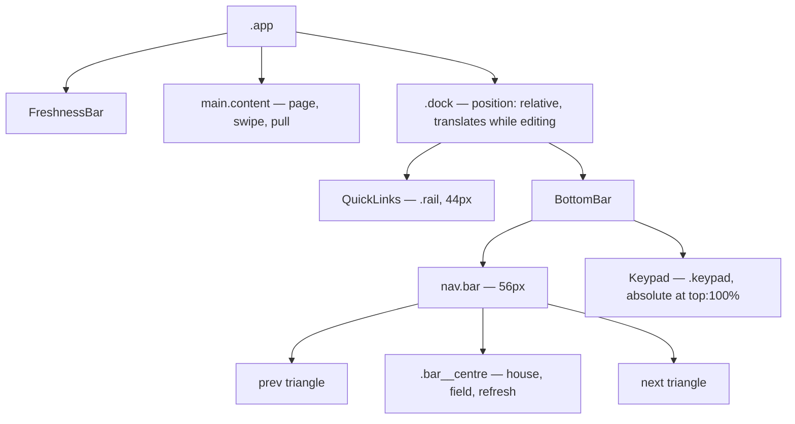
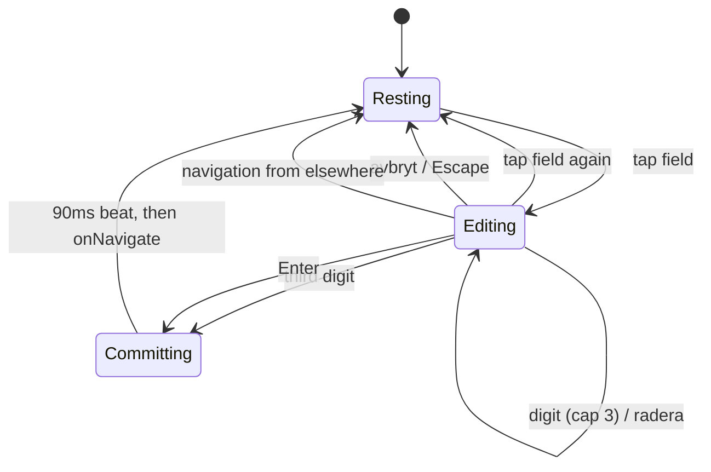

# Merged Page Field and Keypad - Plan

## Goal Capsule

- **Objective:** the bottom bar carries one page control that both reports the page you are on and takes the page you want, and every chrome glyph draws reliably on any font stack.
- **Means:** merge `.bar__input` and `.bar__page` into one field that opens an in-app three-digit keypad (KTD1, KTD2).
- **Authority:** `misc/design/README.md` is the design authority for colours, sizes, and timings. This plan is the authority for how they land in the React codebase. Repo conventions in `CLAUDE.md` outrank both on testing and code shape.
- **Execution profile:** app-level tests with the network faked at the HTTP boundary; existing bar tests in `src/app.test.tsx` are migrated, not duplicated.
- **Stop conditions:** stop and ask if the swipe hook cannot report the commit threshold without restructuring its per-frame path (U6), or if the keypad cannot be made inert to the pull gesture without restructuring `useSwipeNavigation`.
- **Tail ownership:** the caller owns commit, review, and shipping.

---

## Product Contract

### Summary

Replace the bottom bar's two page controls with one merged field. At rest the field shows the current page. Tapped, it becomes the entry field: the digits typed replace the number, a caret appears, and a three-digit keypad rises from the bottom of the screen. The control row is re-laid-out so the arrows sit at the outer edges of the control row and home, field, and refresh group in the middle. The `◀`, `▶`, and `⌂` glyphs become CSS-drawn shapes.

### Problem Frame

The bar carries a three-digit input and a separate current-page span. They say the same thing twice and compete for a control row that is already tight at 390px — `src/index.css` records the 2px gap and 10px padding it took to fit six controls. The arrow and house glyphs fall back to emoji or tofu on common Android and Windows font stacks.

### Key Decisions

- **1a "svart" is the chosen chrome palette.** The `nyckel` and `band` palettes in `misc/design/Bar colours.dc.html` are out. Governs R12.
- **Arrows and the house are drawn, not glyphs.** `◀ ▶ ⌂` are unreliable across font stacks; `↻` renders reliably and stays a glyph. Governs R3, R4.
- **A page that is not broadcast is not special-cased.** Navigate optimistically and let `NotBroadcast` render, exactly as a hotspot tap does today. Governs R9, R25.

### Requirements

**Bar layout**

- R1. The control row is `display: flex; align-items: center; justify-content: space-between; padding: 0 6px` with exactly three children: prev button, centre group, next button. It keeps `.bar__inner`'s `max-width: var(--frame-max)` so the controls follow the reading column as they do today, and drops the `gap: 2px` the old five-control run needed.
- R2. The centre group is `display: flex; align-items: center; gap: 6px` holding home button, page field, refresh button, in that order.
- R3. Prev and next are 52×52px hit areas drawing a CSS-border triangle 12px deep by 18px tall — `#fff` enabled, `#3a3a3a` when the page has no neighbour that way.
- R4. Home is a 48×48px hit area drawing a 20×17px house from a border triangle roof and a block body, in `#fff`.
- R5. Refresh is a 48×48px hit area holding the `↻` glyph at 21px, `#fff`, dimming to `#3a3a3a` while a fetch is in flight.
- R6. No control carries a border radius anywhere in the bar or keypad.

**The merged page field**

- R7. One field replaces both `.bar__input` and `.bar__page`. It is `min-width: 78px; height: 40px`, centred, with a 2px bottom border. It renders in `--mono` at 22px with `letter-spacing: .06em` and `font-variant-numeric: tabular-nums`, inheriting the bar's own `font-stretch`.
- R8. The field has three states: resting (current page, `#fff`, `2px solid #2b2b2b` underline, no caret); resting while a horizontal drag is past the commit distance (same, text `#8a8a8a`, because the number is about to be wrong); editing (typed digits, `#ffff00`, `2px solid #ffff00` underline, a 2px × 24px `#ffff00` caret block 2px right of the digits). The text colour transitions `120ms linear` and the underline colour `140ms linear` between states.
- R9. The field is not an `<input>` and never summons the OS keyboard.
- R10. At rest the field's accessible name reports the current page; while editing it reports the entry affordance, and the typed digits reach assistive tech through a live region. The keypad carries its own accessible name and is absent from the accessibility tree and the tab order while closed.

**The keypad**

- R11. Tapping the field starts editing: typed digits reset to empty, the caret appears, and the keypad rises. Tapping the field again while editing closes the keypad.
- R12. The keypad is pinned to the bottom of the shell, full width, `background: #0a0a0a`, `border-top: 1px solid #1c1c1c`, 236px tall plus `padding-bottom: env(safe-area-inset-bottom)` so no key row falls under a home indicator. It is a `grid-template-columns: repeat(3, 1fr); grid-auto-rows: 1fr; gap: 1px` grid over a `#1c1c1c` backing so the gaps read as hairline rules, plus `padding-top: 1px` for the top row's rule.
- R13. Keys in grid order are `1 2 3 / 4 5 6 / 7 8 9 / avbryt 0 radera`; digits `#fff` 26px, `avbryt` `#00ffff` 15px, `radera` `#8a8a8a` 15px, key background `#000`, pressed `#1a1a1a`.
- R14. A digit key appends to the typed digits, capped at three.
- R15. The third digit navigates to that page after a 90ms beat, then closes the keypad.
- R16. `radera` drops the last character and never closes the keypad, including at zero digits.
- R17. `avbryt` closes the keypad and discards the typed digits, leaving the current page unchanged.
- R18. Opening translates the bar and rail up by the keypad's full height including its safe-area padding, bringing the keypad into view, over `220ms cubic-bezier(.32,.94,.28,1)`; closing reverses it. The page area behind is neither resized nor scrolled.
- R19. Under `prefers-reduced-motion: reduce` the keypad appears and disappears outright with no slide.
- R25. Any navigation that does not come from the field — a rail link, prev, next, home, or a hotspot tap — ends editing and closes the keypad, discarding the typed digits. This is R15's behaviour on the field's own commit, applied to every other route.

**Keyboard and gestures**

- R20. With the field focused, `Enter` raises the keypad, `Escape` closes it, and hardware digit keys feed the same path as the on-screen keys. `Enter` is not a confirm key: a page number is three digits, the third digit has already committed, and `navigate` refuses anything shorter (`src/useTextTv.ts:480`), so there is nothing for it to confirm.
- R26. The field holds focus for the whole editing session. An on-screen key press does not move focus, and the keys are outside the tab order; keyboard readers use R20's direct path instead. Focus stays on the field when the keypad closes.
- R21. While the keypad is up, the pull-to-refresh gesture is inert, and the keypad's own surface swallows pointer events.

**Unchanged behaviour**

- R22. Prev and next navigate to the payload's own neighbours. An absent neighbour takes the native `disabled`; a merely-pending one takes `aria-disabled` with a no-op handler.
- R23. Home navigates to `100`. Refresh calls the existing refresh path and takes the `aria-disabled` holding treatment while refreshing.
- R24. `BottomBar` takes the same prop set it takes today, plus a callback reporting editing state and a flag reporting the swipe's armed state (KTD4, KTD6).

### Acceptance Examples

- AE1. **Covers R11, R14, R15.** Given page 100 is open, when the reader taps the field and presses `3`, `3`, `1`, then the app navigates to 331 and the keypad closes.
- AE2. **Covers R14, R16.** Given the reader has typed `33`, when they press `radera`, then the field reads `3` and the keypad is still up.
- AE3. **Covers R17.** Given the reader has typed `33` on page 100, when they press `avbryt`, then the keypad closes and the field reads `100`.
- AE4. **Covers R9.** Given the reader taps the field, then no element with `inputmode` or a text input type receives focus.
- AE5. **Covers R22.** Given page 100 is open, then prev is `disabled` and next is enabled.
- AE6. **Covers R25.** Given the reader has typed `33` on page 100, when they tap the `300 SPORT` rail link, then the app navigates to 300, the keypad closes, and the field reads `300`.

### Scope Boundaries

- The QuickLinks rail's own contents, colours, and scrolling behaviour are unchanged; it only gains the shared slide transform.
- The freshness bar, page renderer, and hotspot layer are untouched.
- The swipe gesture's commit thresholds, snap timings, and commit decision are unchanged. U6 adds a read-only report of the distance floor being crossed; it changes nothing about when a swipe commits.

#### Deferred to Follow-Up Work

- A keypad height proportional to the viewport with a floor near 200px, for short devices (see Open Questions).

#### Outside this product's identity

- A placeholder ghost of the current page behind half-typed digits. Tried in the design and removed: a greyed `377` behind a `3` reads as a mistake.
- A confirm key. Three digits are the whole instruction.

### Open Questions

- Deferred: 236px is tuned at 390×844. Whether short devices want a proportional height with a ~200px floor is unresolved and does not block implementation — U3 puts the height behind one CSS custom property so the answer lands in one place.

### Sources

- `misc/design/README.md` — the design handoff; colours, sizes, timings, and state tables. Its parenthetical calling `font-stretch: 130.4%` "the bar's existing stretch" is wrong about this codebase: `src/index.css:725` sets `150%`. R7 follows the codebase.
- `misc/design/Teletext phone.dc.html` — behavioural prototype (`onFieldTap`, `press`, `goTo`, `KEYS`, and the `padY` / `barY` / `fieldColor` / `fieldRule` / `caretOpacity` values in `renderVals`). Reference only; none of its markup is lifted.
- `src/components/BottomBar.tsx:43-64` — the existing `holding` treatment and `onType` commit-on-third-digit behaviour, both carried forward.
- `src/index.css:723-796` — the bar rules being replaced, including the recorded 390px fit measurement.
- `src/useSwipeNavigation.ts:365,469` — where the pull already refuses itself while a fetch runs; U5 joins editing to the same refusals.
- `src/useSwipeNavigation.ts:373` — `onPullState('below')`, the precedent U6 copies: a gesture-state callback written at most twice per gesture rather than per frame.
- `docs/solutions/best-practices/a-hand-driven-css-transition-must-check-who-owns-the-element-before-finishing.md` and `a-transitionend-listener-on-a-container-must-check-its-target.md` — apply if U3 ends up listening for `transitionend`.

---

## Planning Contract

### Key Technical Decisions

- KTD1. **The merged field is a `<button type="button">`, not an `<input>`.** An input with `inputMode="numeric"` summons the OS keypad, which is the thing the in-app keypad replaces. A button is focusable, takes `keydown` for R20, and needs no `readOnly`/`preventDefault` fight. Its accessible name comes from `aria-labelledby` pointing at a visually-hidden `Aktuell sida` span plus the field's own text, not from `aria-label` — an `aria-label` on a button overrides its text content, which would silence the page number R10 requires. Governs R9, R10, R20.
- KTD2. **`BottomBar` renders the bar and the keypad as siblings; `App` wraps the rail and `BottomBar` in one `.dock` that translates.** The design describes the bar riding up 236px while the keypad rises 236px — the same picture as a single container translating up with the keypad parked at `top: 100%`. One element, one transform, one transition, and the rail rides with the bar as the design shows. Rendering the keypad from `BottomBar` keeps `editing`, `typed`, and `press()` in one component with no handler plumbed through `App`. `.dock` is `position: relative; flex: 0 0 auto` — relative so the keypad's `top: 100%` resolves against it, and non-shrinking because wrapping takes `.rail` and `.bar` out of the shell's flex line where they carry that themselves today. Governs R18, R19.
- KTD3. **The keypad height is the CSS custom property `--keypad-height`, defaulting to 236px.** The keypad's own box, the dock's slide distance, and any future proportional rule then have one owner. The slide is `translateY(calc(-1 * (var(--keypad-height) + env(safe-area-inset-bottom))))` so the keypad lands flush at the viewport bottom on an inset device. Governs R12, R18.
- KTD4. **`editing` lives in `BottomBar` and is reported upward through a new `onEditing` callback.** The state that drives the field and the keypad belongs where they are rendered; the shell needs only the boolean, to make the pull gesture inert (R21) and to drive `.dock--editing`. Call it from the handlers that toggle `editing`, not from an effect, so the swipe guard sees the new value in the same frame the keypad opens. Governs R18, R21, R24.
- KTD5. **The pull guard reuses the `refreshing` shape in `useSwipeNavigation`.** That hook already refuses a pull while a fetch is in flight, through `latest.current.refreshing` at `src/useSwipeNavigation.ts:365` and `:469`. Editing joins it as a second reason to refuse, rather than a new mechanism. Governs R21.
- KTD6. **The swipe hook reports the armed state through a new `onArmed` callback, modelled on `onPullState`.** The dimmed field is the design's "this number is about to be wrong" signal, so it has to follow the commit distance rather than the whole drag. `onPullState` already shows the shape: gesture state written at most twice per gesture, not per frame — the horizontal branch can do the same by firing only when `Math.abs(travel)` crosses `SWIPE_MIN_DISTANCE`. Report the distance floor only, not the flick path: `swipeDirection` also commits a short fast flick using a release velocity that does not exist mid-drag, so no mid-drag signal can be exact. Under `prefers-reduced-motion: reduce` the hook returns before any per-frame work (`src/useSwipeNavigation.ts:391`), so `onArmed` never fires and the field stays at rest for the whole swipe — consistent with a mode that shows no mid-drag state at all. Governs R8, R24.
- KTD7. **Existing bar tests are migrated in place, not added alongside.** `src/app.test.tsx` drives the old input through `userEvent.type` and asserts `inputmode`/`maxlength` at lines 458-481 and 2148-2170. Those assertions describe a control that stops existing; leaving them and adding new ones would leave the suite asserting two contradictory bars.
- KTD8. **The keypad stays mounted and goes `inert` when closed.** Unmounting it on close would make it vanish instantly while the dock spends 220ms sliding back down, so R18's closing slide would play over empty space. `inert` plus `aria-hidden` keeps the keys off the tab order and out of the accessibility tree while closed (R10) without removing the element the transform needs. Governs R10, R18.
- KTD9. **Keypad keys never take focus; the field holds it for the whole session.** Pressing a key with the default focus behaviour would move focus off the field, and U4's single `keydown` listener lives there — a reader who taps `3` and then reaches for `Escape` would get nothing. Suppress the default on pointer-down and keep the keys out of the tab order (R26). Governs R20, R26.

### High-Level Technical Design

Directional. The implementer owns the exact shape.

The shell gains one wrapper so the chrome moves as a unit:

The field and keypad are one small state machine inside `BottomBar`:

`Committing` is a timer, not a stored state: the third digit schedules the navigate-and-close and the field keeps painting the three digits until it fires.

### Assumptions

- The rail and bar together are what the design calls "the bar"; both ride up. The design's own layout section describes them as two stacked rows of one `nav.bar`, and the app renders them as siblings.
- `--bar-height` (56px) and `--rail-height` (44px) in `src/index.css` already match the design's stated row heights, so the frame budget calculation needs no change.
- The 90ms commit beat is a `setTimeout`, cleared on unmount.
- The caret does not blink; the design specifies no blink.
- No visually-hidden utility exists in `src/index.css` today; U2 adds one for the live region and the field's label span.

### Sequencing

U1 → U2 → U3 → U4 → U5, with U6 any time after U2. U1 lands the layout and drawn glyphs so U2 has the row to sit the field in. U3 needs U2's `editing` state. U4 and U5 both depend on U3 and are independent of each other. U6 feeds the field's dimmed state and only needs the field to exist.

---

## Implementation Units

### U1. Re-lay-out the control row and draw the glyphs

- **Goal:** the control row is prev / centre group / next, with CSS-drawn triangles and house.
- **Requirements:** R1, R2, R3, R4, R5, R6, R22, R23.
- **Files:** `src/components/BottomBar.tsx`, `src/index.css`, `src/app.test.tsx`.
- **Approach:** replace `.bar__inner`'s flat run of five controls with three children — prev button, a `.bar__centre` group, next button. Give the buttons empty spans that carry the drawn shapes (`.bar__glyph--prev`, `--next`, `--home`), keeping the existing `aria-label`s so the shapes stay nameless to assistive tech. Drop the `◀ ▶ ⌂` text. Keep the `holding` treatment and the `arrow()` helper from `src/components/BottomBar.tsx:43-52` unchanged. Colour the disabled shapes by targeting the glyph span from the button's `:disabled` / `[aria-disabled='true']` state — a border-drawn triangle takes its colour from `border-*-color`, not `color`.
- **Test scenarios:** prev is `disabled` and next enabled on page 100 (AE5, existing test at `src/app.test.tsx:438`); a pending page gives next `aria-disabled` without stealing focus (existing tests carry this); clicking next navigates past a page that is not broadcast (the existing test at `src/app.test.tsx:428`, tagged `// AE3` under the legacy suite's own numbering — not this plan's AE3); clicking home navigates to 100. These are existing tests that must keep passing against the new markup — no new test needed beyond keeping the labels stable.
- **Verification:** `npm test`, `npm run build`.

### U2. The merged page field

- **Goal:** one field reports the current page and takes typed digits; the separate input and page span are gone.
- **Requirements:** R7, R8, R9, R10, R24; KTD1, KTD7.
- **Files:** `src/components/BottomBar.tsx`, `src/App.tsx`, `src/index.css`, `src/app.test.tsx`.
- **Approach:** delete the `<input class="bar__input">` and the ``. Add one `<button type="button" class="bar__page-field">` whose text is `typed` while editing and `pageNumber` otherwise. Name it with `aria-labelledby` pointing at a visually-hidden `Aktuell sida` span plus the button itself, so the computed name is `Aktuell sida 377` and `getByLabelText('Aktuell sida')` still resolves to it (KTD1); switch the label span's text to `Gå till sida` while editing. Add a visually-hidden `aria-live="polite"` span carrying the typed digits, and the `.visually-hidden` utility both need. Render the caret as `.bar__caret` inside the field, present only while editing. Add an `armed: boolean` prop threaded from `App` for R8's dimmed colour, fed by U6. Replace the `onType` change handler with a `press(key)` function that U3's keypad and U4's keyboard both call; keep its commit-on-third-digit contract from `src/components/BottomBar.tsx:54-64`. Add the `onEditing` prop (KTD4), called from the handlers that toggle `editing`. Remove `.bar__input` and `.bar__page` from `src/index.css` and add `.bar__page-field` / `.bar__caret` with R7's type and R8's transitions.
  Migrate the existing tests at `src/app.test.tsx:458-481` and `:2148-2170` off `userEvent.type` (KTD7). Assertions that read the field's text keep working through the composed accessible name; the `inputmode`/`maxlength` test becomes a test that tapping the field summons the keypad rather than an OS keyboard. The visual-viewport test at `:2148` keeps its viewport-shrink wiring assertions but drives navigation through the field, and its name stops claiming an OS keyboard is up — with no `<input>` left in the app, that state can no longer occur.
- **Test scenarios:** at rest the field shows the current page and updates when the page changes (existing `currentPage` helper covers this); the field's accessible name carries both `Aktuell sida` and the page number; tapping the field clears it to empty and shows the caret; no element with `inputmode` exists in the bar after tapping (AE4); the label reads `Gå till sida` while editing; the field carries the dimmed class while `armed`.
- **Verification:** `npm test`, `npm run build`.

### U3. The keypad and the dock slide

- **Goal:** tapping the field raises a three-digit keypad; the chrome rides up with it.
- **Requirements:** R10, R11, R12, R13, R14, R15, R16, R17, R18, R19, R25; KTD2, KTD3, KTD8.
- **Files:** new `src/components/Keypad.tsx`, `src/App.tsx`, `src/components/BottomBar.tsx`, `src/index.css`, `src/app.test.tsx`.
- **Approach:** add `Keypad` taking `open: boolean` and `onPress(key: string)`, rendering the twelve keys in grid order from a module-level `KEYS` array — Swedish `avbryt` and `radera` as real lowercase text, matching the inline-Swedish convention. Give the container an accessible name (`aria-label="Knappsats"`) and mark it `inert` plus `aria-hidden` while closed (KTD8, R10). Render it from `BottomBar` as a sibling of `nav.bar` so `press()` needs no plumbing (KTD2). In `src/App.tsx` wrap `QuickLinks` and `BottomBar` in `
`, `position: relative; flex: 0 0 auto`, with `.dock--editing` driving the transform. Position `.keypad` absolutely at `top: 100%` so it stays out of flow and the page area behind is not resized. Define `--keypad-height: 236px` on `:root` and drive both the keypad's height and the dock's `translateY` from it, adding `env(safe-area-inset-bottom)` to each (KTD3, R12). Use `transform 220ms cubic-bezier(.32,.94,.28,1)`, disabled under a `@media (prefers-reduced-motion: reduce)` block (R19). Give keys `:active` background `#1a1a1a`. For R25, close editing whenever `pageNumber` changes from outside the field's own commit — the simplest form is an effect on `pageNumber` that ends editing, which the field's own commit already satisfies because it closes first.
- **Test scenarios:** tap the field then press `3`,`3`,`1` and the app lands on 331 with the keypad gone (AE1); press `3`,`3` then `radera` and the field reads `3` with the keypad still up (AE2); press `avbryt` after two digits and the keypad closes with the page unchanged (AE3); tapping a rail link with digits typed navigates and closes the keypad (AE6); a fourth digit press does not extend beyond three; tapping the field a second time closes the keypad; the keypad is `inert` when closed and not when open; the dock carries the editing class while the keypad is up. happy-dom runs no transitions, so assert classes and DOM state, not computed transforms.
- **Verification:** `npm test`, `npm run build`.

### U4. Keyboard and assistive-tech path

- **Goal:** the field works from a hardware keyboard, keeps focus throughout, and announces what was typed.
- **Requirements:** R10, R20, R26; KTD9.
- **Files:** `src/components/BottomBar.tsx`, `src/components/Keypad.tsx`, `src/app.test.tsx`.
- **Approach:** put one `onKeyDown` on the field. `Escape` closes; `Enter` raises the keypad and does nothing while it is up; `0`-`9` feed `press()`. Give each keypad key `onPointerDown` with `preventDefault()` and `tabIndex={-1}` so pressing one never moves focus off the field (KTD9, R26). Let the button's native space/enter activation raise the keypad when not editing, and make sure `Enter` while editing does not also re-toggle it. The live region added in U2 carries the typed value.
- **Test scenarios:** focus the field, press `Enter`, then type `2`,`0`,`0` on the hardware keyboard and land on 200; tap an on-screen key and confirm the field still holds focus, then press `Escape` and the keypad closes; `Enter` with two digits typed changes nothing; the live region's text follows the typed digits.
- **Verification:** `npm test`, `npm run build`.

### U5. The keypad is inert to the pull gesture

- **Goal:** pull-to-refresh does not fire while the keypad is up.
- **Requirements:** R21; KTD4, KTD5.
- **Files:** `src/App.tsx`, `src/useSwipeNavigation.ts`, `src/index.css`, `src/app.test.tsx`.
- **Approach:** hold the `editing` boolean in `App` from `BottomBar`'s `onEditing`, pass it into `useSwipeNavigation` beside `refreshing`, and add it to the same `latest.current` snapshot the hook already keeps. Refuse the pull where `refreshing` is refused today — `src/useSwipeNavigation.ts:365` on the arming branch and `:469` on release. That refusal is what makes the guard work; give `.keypad` `touch-action: none` as well so a drag on the keys does not scroll the shell.
- **Test scenarios:** with the keypad up, a downward pull past `PULL_THRESHOLD_PX` on the content area starts no fetch and leaves the pull strip idle; with the keypad closed the same pull still refreshes (existing pull tests cover this and must keep passing); a sideways swipe still navigates while the keypad is closed.
- **Verification:** `npm test`, `npm run build`.

### U6. Report the swipe's armed state

- **Goal:** the field can dim exactly while the current page is about to be wrong.
- **Requirements:** R8, R24; KTD6.
- **Files:** `src/useSwipeNavigation.ts`, `src/App.tsx`, `src/app.test.tsx`.
- **Approach:** add an `onArmed(armed: boolean)` callback to the hook's options, modelled on `onPullState` at `src/useSwipeNavigation.ts:373`. In the horizontal per-frame branch, track whether `Math.abs(travel) >= SWIPE_MIN_DISTANCE` and call `onArmed` only on a change, so it writes at most twice per gesture. Clear it to `false` wherever the gesture ends — commit, cancel, and abort alike, including the rescue listeners — so an interrupted snap cannot leave the field dimmed. Hold the boolean in `App` and pass it to `BottomBar` as `armed`. Do not touch `swipeDirection` or the commit decision.
- **Test scenarios:** a horizontal drag of less than `SWIPE_MIN_DISTANCE` leaves the field undimmed; a drag past it dims the field; releasing, cancelling, or aborting the gesture undims it; a committed swipe leaves the field undimmed on the new page; a vertical pull never dims the field.
- **Verification:** `npm test`, `npm run build`.

---

## Verification Contract

| Gate | Command | Applies to |
| --- | --- | --- |
| Unit and app tests | `npm test` | U1-U6 |
| Typecheck and production build | `npm run build` | U1-U6 |

The whole of `src/app.test.tsx` must pass, including the swipe, pull-to-refresh, and freshness suites that were not touched — they render `BottomBar` and read `Aktuell sida` throughout, so they are the regression net for the rewrite. No test may be weakened or deleted to make the new bar pass; a test whose subject genuinely stops existing is migrated per KTD7 with its intent preserved.

## Definition of Done

**Global**

- `npm test` and `npm run build` both pass.
- `.bar__input` and `.bar__page` no longer appear in `src/index.css` or `src/components/BottomBar.tsx`.
- No `◀`, `▶`, or `⌂` glyph remains in `src/components/BottomBar.tsx`.
- No `border-radius` appears in the bar or keypad rules.
- All user-visible strings are Swedish and inline.
- No abandoned experimental code, dead CSS rules, or commented-out markup is left in the diff.

**Per unit**

| Unit | Done when |
| --- | --- |
| U1 | The control row is three flex children and the arrows and house are drawn with CSS borders; the existing arrow, home, and disabled-state tests pass unchanged. |
| U2 | One field carries both the current page and the typed digits, its accessible name reports both, no `<input>` remains in the bar, and the migrated tests assert the new control rather than the old one. |
| U3 | Tapping the field raises a keypad driven by `--keypad-height`, the dock slides as one, the keypad is `inert` when closed, and AE1-AE3 and AE6 pass. |
| U4 | `Escape` and hardware digits reach the field's own handler, an on-screen press leaves focus on the field, and the live region reports the typed digits. |
| U5 | A pull past the threshold with the keypad up starts no fetch, and every existing pull test still passes. |
| U6 | The field dims only past the commit distance and undims on every gesture end, with the commit decision itself unchanged. |
