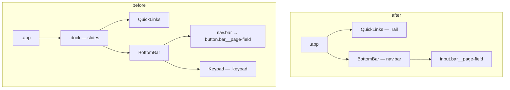
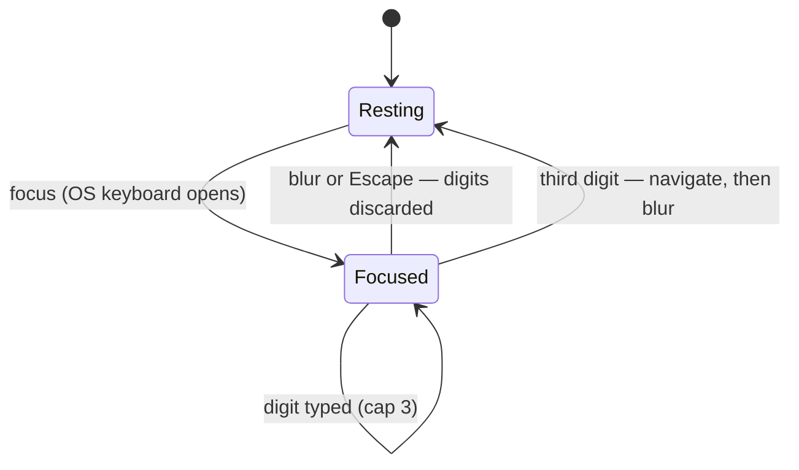

# Use the OS Numeric Keyboard - Plan

## Goal Capsule

- **Objective:** tapping the page field brings up the phone's own numeric keyboard, the way it did before the in-app keypad shipped.
- **Means:** make the merged field an `<input inputMode="numeric">` again and delete the keypad, the dock, and the machinery that existed only to serve them (KTD1).
- **Authority:** the user's instruction is the authority here and overrides `misc/design/README.md`, which specifies the keypad. This plan is the authority for how the reversal lands.
- **Execution profile:** app-level tests with the network faked at the HTTP boundary. The field's test migration lands **with** the field in U1, so the suite is green at every unit boundary rather than red for three units.
- **Stop conditions:** stop and ask if restoring the input cannot keep the merged display — one control showing both the current page and the digits being typed — without a second element.
- **Tail ownership:** the caller owns commit, review, and shipping.

---

## Product Contract

### Summary

Delete the in-app keypad and give the page field back to the operating system. The field becomes a three-digit `<input>` again: `inputMode="numeric"` with `pattern="[0-9]*"`, which is what makes iOS open its numeric keypad. It keeps the merged display shipped in `ca7c238` — the current page number at rest, the digits being typed once focused — so only the keyboard changes, not the control.

### Problem Frame

Before `ca7c238` the bar held an `<input type="text" inputMode="numeric" pattern="[0-9]*">`, and iOS answered a tap on it with its own numeric keypad. That commit replaced the input with a `<button>` and a twelve-key pad drawn in the app, on the reasoning recorded as KTD1 in the origin plan: a button cannot summon the OS keyboard, so the app's pad is the only thing that appears. The reasoning was sound and the conclusion was not wanted — the platform keyboard was already good enough, and what replaced it is a home-built substitute for a solved problem.

### Key Decisions

- **The page field uses the operating system's numeric keyboard; the app ships no keypad of its own.** (session-settled: user-directed — chosen over the in-app twelve-key keypad shipped in `ca7c238`: an OS-provided numeric keyboard is good enough, and iOS already defaults to it from `inputMode="numeric"`.) Governs R1, R2, R7.
- **The merged field itself stays.** (session-settled: user-directed — chosen over reverting to the pre-merge pair of a separate `.bar__input` and a `.bar__page` span: the objection names the keyboard, not the merge.) Governs R3, R4.

### Requirements

**The field**

- R1. The page field is an `<input>` with `type="text"`, `inputMode="numeric"`, `pattern="[0-9]*"`, and `maxLength={3}` — the combination iOS answers with its numeric keypad.
- R2. No component, stylesheet rule, or design token in the app draws a keypad.
- R3. The field shows the current page number when it is not focused, and the digits typed so far when it is. Focusing it clears it; blurring it discards any partial digits and restores the current page. It carries no placeholder, so a focused empty field is blank — the design handoff records the ghost-behind-the-digits effect as tried and removed. A page change arriving while the field is focused — a swipe, the back button — leaves the typed digits alone and is picked up when the field blurs.
- R4. The field keeps its shipped appearance: `width: 78px; height: 40px`, `text-align: center`, 2px bottom border, `--mono` at 22px with `letter-spacing: .06em` and `font-variant-numeric: tabular-nums`, no border radius. Resting `#fff` on `#2b2b2b`; `#8a8a8a` while a swipe is past the commit distance; `#ffff00` on `#ffff00` with a `#ffff00` caret while focused. Focus outranks the swipe dimming when both apply.
- R5. The third digit navigates to that page and blurs the field, which dismisses the keyboard. There is no confirm key and no commit delay.
- R6. The field's accessible name is state-neutral, so it is honest both when it reports the page being read and when it takes the page being asked for; its value carries the number.
- R17. `Escape` while the field is focused abandons the entry, discarding the typed digits — the keyboard-only equivalent of tapping away.

**What goes with the keypad**

- R7. `src/components/Keypad.tsx` is deleted, along with the `.keypad*` rules and the `--keypad-height` token.
- R8. The `.dock` wrapper and its slide are removed; the rail and the bar go back to being siblings in the app shell, because nothing is revealed beneath them any more.
- R9. `useSwipeNavigation` loses its `editing` option and the pull refusals that read it, returning that hook to the options it carried before `0058752`.
- R10. The visually-hidden label span and typed-digits live region go, along with the `.visually-hidden` utility — an input announces its own label and value, and nothing else uses that utility.

**Unchanged behaviour**

- R11. The bar keeps its three-child layout, its CSS-drawn arrows and house, and the refresh glyph.
- R12. The field still dims while a horizontal drag toward an existing neighbour is past the commit distance.
- R13. Prev, next, home, refresh, the rail, and hotspots behave exactly as they do today.
- R14. The shell still follows the visual viewport when the keyboard shrinks it, through the existing `useVisualViewport`.

**Knowledge artifacts**

- R15. Repo documentation that describes the keypad as live code is corrected: the `Keypad` and `Dock` entries in `CONCEPTS.md`, and the learning at `docs/solutions/best-practices/a-surface-dismissed-on-the-state-change-stays-open-for-the-action-that-changes-nothing.md`, whose cited mechanism this change deletes.
- R16. `misc/design/README.md` gains a short note at the top recording that the keypad it specifies was built and then withdrawn, so a future reader does not implement it again.

### Acceptance Examples

- AE1. **Covers R1.** Given the bar is rendered, then the page field carries `inputmode="numeric"`, `pattern="[0-9]*"`, and `maxlength="3"`.
- AE2. **Covers R3, R5.** Given page 100 is open, when the reader focuses the field and types `3`, `3`, `1`, then the app navigates to 331 and the field shows `331` once it is no longer focused.
- AE3. **Covers R3.** Given the reader has typed `33` and then blurs the field, then the field reads the current page again and the page has not changed.
- AE4. **Covers R2, R7.** Given the app is rendered, then no element carrying a keypad class exists in the document.
- AE5. **Covers R17.** Given the reader has typed `33`, when they press `Escape`, then the field reads the current page again and the page has not changed.

### Scope Boundaries

- The merge itself, the drawn glyphs, the control-row layout, and the armed dimming all stay exactly as shipped.
- The swipe and pull gestures keep their thresholds and timings; only the `editing` refusal added in `0058752` goes.
- The origin plan is left as the dated record it is. This plan's Sources section is where the reversal is recorded; a shipped plan is not annotated after the fact.

#### Deferred to Follow-Up Work

- Whether the field should reject a non-broadcast number before navigating. Unchanged by this plan and unchanged before it.

#### Outside this product's identity

- Any in-app keyboard, keypad, or number pad. That is the decision this plan exists to record.

### Open Questions

- Deferred: the 90ms commit beat goes with the keypad (KTD3). If the third digit turns out to feel abrupt against a dismissing OS keyboard, a beat can come back as its own change; nothing here forecloses it.
- Deferred: blurring on the third digit drops focus to `<body>`, which is the pre-`ca7c238` behaviour being restored rather than something this plan introduces. Worth a look on a real screen reader before deciding it needs a focus destination.

### Sources

- `docs/plans/2026-08-28-1854-feat-merged-page-field-and-keypad-plan.md` — the origin plan. Its R9/R11-R19/R20/R26 and KTD1/KTD2/KTD3/KTD8/KTD9 are what this plan reverses; its R1-R8 and KTD6 stand.
- `git show bb994cc:src/components/BottomBar.tsx` — the input and its `onType` handler as they stood before the keypad, including the `type`/`inputMode`/`pattern`/`maxLength` combination R1 restores. Its `placeholder="000"` is **not** restored (R3).
- `git show bb994cc:src/index.css` line 753 — the pre-keypad `.bar__input` rule, whose `width: 3.8em; text-align: center` is why R4 names an explicit width and centring rather than the flex centring that styles the button today.
- `src/useTextTv.ts:479-483` — `navigate` refuses a page number that is not three digits, which is why R5 commits only on the third.
- `src/index.css:56` — the `--frame-budget` comment whose short-viewport example still names the keypad.

---

## Planning Contract

### Key Technical Decisions

- KTD1. **The field is a controlled `<input>` whose value swaps on focus.** (session-settled: user-directed — chosen over the `<button>` plus in-app keypad of the origin plan's KTD1: the OS keyboard is good enough. Governs R1, R2, R7.) `value={focused ? typed : pageNumber}`, with `onFocus` clearing `typed` and `onBlur` restoring the resting display. One element carries both jobs, so the merge survives without a second node to keep in step.
- KTD2. **Delete rather than disable.** `Keypad.tsx`, the `.keypad*` rules, `--keypad-height`, `.dock`, the `editing`/`onEditing` props, and the hook's `editing` option all go in full. A keypad left behind a flag is a second implementation of page entry that nothing exercises. Governs R2, R7, R8, R9.
- KTD3. **The 90ms commit beat goes.** It existed so the reader saw the third digit land before the app's own pad slid away; a native keyboard dismisses itself on blur and needs no help. Removing it also removes the timer, its cleanup, and the guard against keys arriving inside it. Governs R5.
- KTD4. **Blur, not a hand-rolled dismissal, ends an entry.** Tapping any other control moves focus, which fires `onBlur`, which clears the digits — no matter whether the page number changes. The origin plan's R25 and its `go()` wrapper in `src/App.tsx` were built to catch the navigations that change no page; the platform does that for free once the field is focusable. Governs R3, R8.
- KTD5. **The field's styling comes from the pre-keypad rule, not the button's.** `.bar__page-field` centres today with `display: flex; justify-content: center`, which moves a button's child text but not an input's value — that needs `text-align`. An input also takes its intrinsic width from the default `size=20`, which `min-width` cannot cap. So the rule takes `width: 78px; text-align: center` and drops the flex properties, exactly as `.bar__input` did at `bb994cc`. Governs R4.
- KTD6. **The accessible name goes state-neutral.** A `<button>` could compose "Aktuell sida 377" from a hidden label plus its own text; an input cannot, because its value is an accessible *value* rather than part of the name — a fixed `aria-label="Aktuell sida"` would announce "current page" while the reader types a destination. One neutral Swedish name, `Sida`, is honest in both states. The suite's `getByLabelText` locator moves with it. Governs R6, R10.
- KTD7. **The field's test migration lands in U1, with the field.** `currentPage()` and ~23 inline assertions read the field as text today; an input holds a value instead, so they break the moment the element changes. Migrating them in the same unit keeps every unit boundary green, rather than leaving the suite red across three units. Governs the Verification Contract.

### High-Level Technical Design

Directional.

The shell loses a level and the bar loses a child:

The field's states reduce to what focus already tracks:

### Assumptions

- `inputMode="numeric"` with `pattern="[0-9]*"` on a `type="text"` input is what opens the iOS numeric keypad; this is the combination the app shipped before `ca7c238` and it is restored verbatim rather than re-derived.
- Nothing outside `BottomBar` reads `editing`, so removing it from `App` and the swipe hook touches no other consumer.
- `useVisualViewport` needs no change: it was kept through the keypad work and its listeners are unconditional.
- CSS specificity already gives focus precedence over the armed dimming — `.bar__page-field:focus` outranks the single-class `.bar__page-field--armed` — so R4's precedence needs no extra selector.

### Sequencing

U1 → U2 → U3 → U5. U1 changes the control and moves the suite with it; U2 and U3 remove what the control no longer needs; U5 corrects the documentation the removal invalidates. Every unit ends with a green suite.

---

## Implementation Units

### U1. The field is an input again

- **Goal:** tapping the page field opens the phone's numeric keyboard, and the suite describes the control that exists.
- **Requirements:** R1, R3, R4, R5, R6, R10, R11, R12, R13, R14, R17; KTD1, KTD3, KTD4, KTD5, KTD6, KTD7.
- **Files:** `src/components/BottomBar.tsx`, `src/App.tsx`, `src/index.css`, `src/app.test.tsx`.
- **Approach:** replace the `<button class="bar__page-field">` with an `<input class="bar__page-field">` carrying `type="text"`, `inputMode="numeric"`, `pattern="[0-9]*"`, `maxLength={3}`, and `aria-label="Sida"` (KTD6). No `placeholder`. Hold `focused` and `typed`; `value` is `focused ? typed : pageNumber`. `onFocus` sets `focused` and clears `typed`; `onBlur` clears both. Restore the `onType` shape from `git show bb994cc:src/components/BottomBar.tsx` — strip non-digits, cap at three, and on the third digit blur the input and navigate. Keep one small `onKeyDown` that blurs on `Escape` (R17). Delete the `Keypad` import and render, the `editing`/`onEditing` props, `press`, `commit`, `COMMIT_BEAT_MS`, the beat ref and its cleanup, the old `onFieldKeyDown`, the `useId` label plumbing, the two visually-hidden spans, and both `useEffect`s that served the keypad's lifecycle. Keep the `armed` prop and its class.
  In `src/App.tsx`, stop passing `editing`/`onEditing` to `BottomBar` — the props are gone, and TypeScript rejects the excess. The `editing` state itself stays until U2, because `.dock` and the swipe hook still read it.
  In CSS, give `.bar__page-field` `width: 78px; text-align: center; caret-color: #ffff00` and drop `display: flex; align-items: center; justify-content: center` and `min-width` (KTD5). Retarget `--editing` to `:focus`. Delete `.bar__caret` and `.visually-hidden`.
  In `src/app.test.tsx`: change `currentPage()` from `toHaveTextContent` to `toHaveValue`, point `pageField()` at the input, and convert the ~23 inline `expect(screen.getByLabelText('Aktuell sida')).toHaveTextContent(...)` assertions plus the `pageField()` text assertion in the visual-viewport test to `toHaveValue`. Move the locator from `Aktuell sida` to `Sida`. Delete the `keypad()`/`tap()` helpers and every test whose subject was the keypad — the `avbryt`/`radera` keys, the inert/aria-hidden exposure, the dock class, the caret, the focus discipline, the hardware-keyboard block, and the dismissal tests that existed only because the pad had to be closed by hand. Restore the visual-viewport test's original name now that an OS keyboard really is what shrinks the viewport.
- **Test scenarios:** the field carries `inputmode`, `pattern`, and `maxlength`, and no `placeholder` (AE1); typing three digits navigates and the field then shows the new page (AE2); typing two digits changes no page, and blurring restores the current page (AE3); `Escape` after two digits restores the current page and changes nothing (AE5); the field shows the current page at rest and updates when the page changes; the field is dimmed while `armed`; the shell still follows a shrunken visual viewport and three digits still navigate while it is shrunk.
- **Verification:** `npm test`, `npm run build`.

### U2. Delete the keypad and the dock

- **Goal:** nothing in the app draws or reveals a keypad.
- **Requirements:** R2, R7, R8, R13; KTD2.
- **Files:** delete `src/components/Keypad.tsx`; `src/App.tsx`, `src/index.css`, `src/app.test.tsx`.
- **Approach:** remove the `.dock` wrapper from `src/App.tsx` so `QuickLinks` and `BottomBar` are siblings of `.content` again, and drop the `editing` state, the `go()` wrapper, and the `setEditing(false)` line in `startRefresh` — every caller goes back to `navigate` directly (KTD4). Delete `.dock`, `.dock--editing`, its reduced-motion block, every `.keypad*` rule, and the `--keypad-height` token. Reword the `--frame-budget` comment at `src/index.css:56`, whose short-viewport example still names the keypad, to name the OS keyboard instead.
- **Test scenarios:** no element with a keypad class exists in the document (AE4); no `.dock` element exists; the existing rail, arrow, home, and hotspot navigation tests pass unchanged.
- **Verification:** `npm test`, `npm run build`.

### U3. The pull gesture forgets about editing

- **Goal:** `useSwipeNavigation` carries only the options it had before the keypad.
- **Requirements:** R9.
- **Files:** `src/useSwipeNavigation.ts`, `src/App.tsx`, `src/app.test.tsx`.
- **Approach:** remove the `editing` option from `Options`, the destructured parameter, both `latest` snapshots, and the two refusals that read `latest.current.editing` (the arming branch and the release branch), leaving the `refreshing` refusals untouched. Delete the two tests that assert the pull is inert while the keypad is up.
- **Test scenarios:** the existing pull-to-refresh suite passes unchanged; a pull past the threshold still refreshes; the `onArmed` dimming tests still pass.
- **Verification:** `npm test`, `npm run build`.

### U5. Correct the documentation the removal invalidates

- **Goal:** no repo document describes the keypad as live code.
- **Requirements:** R15, R16.
- **Files:** `CONCEPTS.md`, `docs/solutions/best-practices/a-surface-dismissed-on-the-state-change-stays-open-for-the-action-that-changes-nothing.md`, `misc/design/README.md`.
- **Approach:** in `CONCEPTS.md`, delete the `Keypad` and `Dock` entries and rewrite `Page field` so it describes the input. In the learning, keep the principle and rewrite its Context and Verification: the `go()` mechanism it documents was removed with the keypad, so cite the code at the commit where it lived and record that the eventual resolution was to stop hand-rolling the dismissal at all — a native input blurs on its own, which is the same lesson arriving from the other side. Add a short note at the top of `misc/design/README.md` recording that the keypad it specifies was built and withdrawn, and pointing at this plan. Leave the origin plan untouched; it is a dated record, and this plan's Sources section is where the reversal lives.
- **Test expectation: none** — documentation only, with no runtime behaviour. Verified by reading.
- **Verification:** `npm run build` (unaffected, but confirms nothing else broke).

---

## Verification Contract

| Gate | Command | Applies to |
| --- | --- | --- |
| Unit and app tests | `npm test` | U1-U3 |
| Typecheck and production build | `npm run build` | U1-U3, U5 |

The suite is green at every unit boundary, U1 included — that is what KTD7 buys. It must end with no test referencing `.keypad`, `.dock`, or `.bar__caret`. A deleted test is only acceptable when its subject stopped existing; a test whose behaviour still exists is re-expressed against the input rather than dropped.

## Definition of Done

**Global**

- `npm test` and `npm run build` both pass.
- `src/components/Keypad.tsx` does not exist, and `keypad`, `dock`, and `--keypad-height` appear nowhere in `src/` — comments included.
- `editing` and `onEditing` appear nowhere in `src/`.
- The page field is an `<input>` carrying `inputMode="numeric"` and `pattern="[0-9]*"`, with no placeholder.
- No repo document describes the keypad as current behaviour.
- No commented-out keypad code or dead CSS is left in the diff.

**Per unit**

| Unit | Done when |
| --- | --- |
| U1 | Tapping the field would open the OS numeric keyboard, three digits navigate, a blur or `Escape` discards a partial entry, and the whole suite is green against the input. |
| U2 | `Keypad.tsx` is gone, the shell has no `.dock`, and no keypad rule, token, or comment remains in `src/index.css`. |
| U3 | `useSwipeNavigation` has no `editing` option and the pull suite passes unchanged. |
| U5 | `CONCEPTS.md`, the learning, and the design handoff all describe the keypad in the past tense. |
